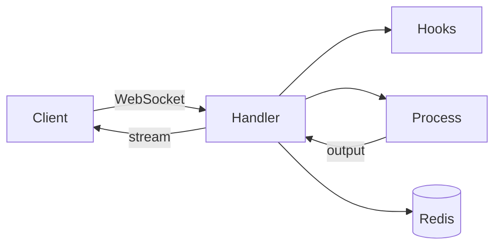

# CC Executor

CC Executor MCP WebSocket Service for remote command execution with Claude Code.

## Why This Exists

This project aims to provide a reliable Claude Code SDK that:
- **Actually runs hooks reliably** (hooks are completely broken in the official implementation)
- **Works with Claude Max** ($200/month Claude Max subscribers)
- **Allows Claude Code to be called programmatically** without hanging
- **Provides consistent subprocess execution** that doesn't mysteriously fail
- **Works around known Claude CLI limitations** (like the missing `--print` flag bug)

The official SDK currently focuses on API-key workflows and does not support browser-authenticated Claude Max users, so they can't:
- Use the API (Claude Max uses browser auth, not API keys)
- Run hooks reliably (they simply don't seem to work)
- Integrate Claude into any automated workflow

After extensive testing with these limitations, this WebSocket-based approach emerged as a reliable way to integrate Claude Code.

**I hope Anthropic will eventually provide full official support for Claude Max subscribers, making this community workaround unnecessary.** Until then, this project aims to fill the gap.

*— A Claude Max user (ok, it's me)*

## Overview

CC Executor is an unofficial Python SDK and WebSocket service for Claude Code Max users.

## Core Features

- **WebSocket JSON-RPC server** (`src/cc_executor/core/websocket_handler.py`) – reliable streaming command execution.
- **Async Python client SDK** (`src/cc_executor/client/client.py`) – programmatic access for Python scripts.
- **Extensible pre/post hooks** (`src/cc_executor/hooks/hook_integration.py` & modules in `src/cc_executor/hooks/`) – virtual-env setup, validation, metrics.
- **Token-limit detection & adaptive retry** (logic in `websocket_handler.py`).
- **Redis-backed session state & execution history** (`src/cc_executor/core/session_manager.py`).
- **Shell consistency with Claude Code** (default shell configured in `src/cc_executor/core/config.py`).

### Comparison with Official Anthropic SDK

| Capability | CC Executor (Unofficial SDK) | Official Anthropic SDK |
|------------|------------------------------|------------------------|
| Works with Claude Max (browser-auth) | ✅ | ❌ |
| Python async client & CLI | ✅ `client/client.py`, `cli/main.py` | ❌ (API only) |
| WebSocket streaming JSON-RPC | ✅ `core/websocket_handler.py` | ❌ |
| Pre / post execution hooks | ✅ `hooks/` | ❌ (hooks in alpha state?) |
| Token-limit detection & adaptive retry | ✅ | ❌ |
| Redis-backed session & history | ✅ `core/session_manager.py` | ❌ |
| Shell consistency (`zsh`) | ✅ | N/A |

## Architecture

The project follows a clean, self-contained directory structure:

```
src/cc_executor/
├── core/           # Core server implementation
│   ├── websocket_handler.py    # Main WebSocket server
│   ├── process_manager.py      # Subprocess execution management
│   ├── stream_handler.py       # Output stream handling
│   ├── resource_monitor.py     # Resource monitoring
│   └── client.py              # WebSocket client for connecting to server
├── cli/            # Command-line interface
│   └── main.py                # Typer-based CLI with all commands
├── hooks/          # Hook system for extensibility
│   ├── pre_execution_hooks.py  # Pre-execution validation
│   ├── post_execution_hooks.py # Post-execution processing
│   └── error_hooks.py         # Error handling hooks
└── templates/      # Self-improving prompt templates
```

### How It Works



**Execution Flow:**
1. Client connects via WebSocket and sends command
2. Pre-execution hooks validate and wrap the command  
3. Redis provides timeout estimates from historical data
4. ProcessManager spawns subprocess with proper isolation
5. Output streams in real-time to client
6. Post-execution hooks update metrics in Redis

## Installation

```bash
# Clone the repository
git clone https://github.com/grahama1970/cc_executor.git
cd cc_executor

# Create virtual environment and install dependencies
uv sync

# Install for development
uv pip install -e .
```

## Advanced Workflow Examples

### 1. Claude + Perplexity Research

Prompt Claude to use the perplexity-ask MCP tool for fact-checking:

```bash
cc-executor run "claude -p --mcp-config .mcp.json --allowedTools 'mcp__perplexity-ask' \
  'Explain quantum entanglement in simple terms. Then use the perplexity-ask mcp tool to \
  research recent breakthroughs in quantum entanglement from 2024-2025 and update your explanation.'"
```

### 2. Using Prompt Files with External Models

Reference prompt files to have Claude use specific models:

```bash
cc-executor run "claude -p \
  'Write a Python implementation of quicksort. Then follow the instructions in \
  ./prompts/ask-litellm.md using the gemini-2.0-flash-exp model to critique the \
  code for efficiency and suggest optimizations.'"
```

Or for a more complex review:

```bash
cc-executor run "claude -p \
  'Create a FastAPI application with user authentication. After implementation, \
  use ./prompts/ask-litellm.md with gemini-2.0-flash-exp to review for security \
  vulnerabilities and best practices.'"  
```

### 3. Parallel Task Execution

Prompt Claude to spawn multiple task instances for comparison:

```bash
cc-executor run "claude -p \
  'I need you to write a haiku about programming. Use your task spawning capabilities to \
  create 5 different variations in parallel, then compare them and select the most creative one. \
  Show me all 5 variations and explain why you chose the winner.'"
```

For more complex parallel tasks:

```bash
cc-executor run "claude -p \
  'Implement a binary search algorithm in Python. Spawn 3 parallel tasks: \
  Task 1: Write an iterative implementation \
  Task 2: Write a recursive implementation \
  Task 3: Write a generic implementation that works with any comparable type \
  Then compare all three for readability, performance, and versatility.'"
```

## Usage

### Command Line Interface

CC Executor provides a comprehensive CLI with the following commands:

```bash
# Start the server
cc-executor server start

# Check server status
cc-executor server status

# Execute a command
cc-executor run "echo Hello, World!"

# Run Claude commands with automatic retry
cc-executor run "claude -p 'What is 2+2?'"

# View execution history
cc-executor history list

# Run assessments
cc-executor test assess core

# Initialize environment
cc-executor init
```

### Programmatic Usage

```python
from cc_executor.core.client import WebSocketClient
import asyncio

async def main():
    client = WebSocketClient()
    
    # Execute a command
    result = await client.execute_command(
        command='echo "Hello from Python!"',
        timeout=30
    )
    
    if result["success"]:
        print(f"Output: {result['output_data']}")
    else:
        print(f"Error: {result['error']}")

asyncio.run(main())
```

## Key Features

### Shell Consistency with Claude Code
- **Configurable shell preference** (zsh, bash, or system default)
- **Defaults to zsh** for consistency with Claude Code execution
- Ensures command parsing and environment behavior matches Claude's environment
- Eliminates shell-specific edge cases and improves reliability

### Token Limit Detection
- Automatically detects when Claude hits output token limits
- Provides adaptive retry strategies with more concise prompts
- Sends real-time notifications via WebSocket

### Hook System
- Pre-execution validation hooks
- Post-execution processing hooks
- Error handling with recovery strategies
- Fully extensible architecture

### Self-Improving Assessments
- Each major directory has self-assessment capabilities
- Behavioral testing (not regex-based)
- Saves raw outputs to prevent AI hallucination
- Generates comprehensive markdown reports

### WebSocket Protocol
- JSON-RPC 2.0 based communication
- Streaming output support with 64KB chunking for large outputs
- Bidirectional error notifications
- Session management with Redis
- Proper subprocess buffer management (8MB limit)

### Memory-Efficient Streaming
- `PYTHONUNBUFFERED=1` for real-time output streaming
- Async streaming prevents memory accumulation
- Chunked WebSocket transmission for large outputs
- Configurable buffer limits and timeouts

## Configuration

Create a `.env` file in the project root:

```bash
# API Keys
ANTHROPIC_API_KEY=your_key_here

# Redis Configuration
REDIS_URL=redis://localhost:6379

# CC Executor Settings
CC_EXECUTOR_PORT=8003
CC_EXECUTOR_HOST=0.0.0.0
LOG_LEVEL=INFO

# Shell Configuration (optional)
CC_EXECUTOR_SHELL=zsh  # Options: zsh, bash, default
# Defaults to zsh for Claude Code consistency

# Process Configuration (optional)
PYTHONUNBUFFERED=1  # Ensures real-time output streaming
STREAM_TIMEOUT=600  # Stream timeout in seconds (default: 10 minutes)
MAX_BUFFER_SIZE=8388608  # Max buffer size in bytes (default: 8MB)
```

## Development

### Running Tests

```bash
# Run all tests
uv run pytest

# Run usage function assessments
cc-executor test assess core
cc-executor test assess cli
cc-executor test assess hooks

# Run stress tests
cc-executor test stress --tasks 10 --parallel 2
```

### Adding Hooks

Create a new hook file in the `hooks/` directory:

```python
from cc_executor.hooks.hook_types import HookContext, HookResult

async def my_custom_hook(context: HookContext) -> HookResult:
    # Your hook logic here
    return HookResult(proceed=True, message="Hook executed")

# Register the hook
HOOKS = {
    "pre_execution": [my_custom_hook]
}
```

## Problems This Solves

### Claude Max ($200/month) Limitations
- **No API access**: Claude Max uses browser auth, API keys don't work
- **Broken hooks**: The hook system is completely non-functional
- **No SDK support**: The official SDK ignores Claude Max users entirely
- **Can't automate**: No way to integrate into workflows despite paying premium

### Claude CLI Issues
- **The `-p` flag confusion**: Claude CLI uses `-p` not `--print`, but this isn't documented
- **Subprocess hanging**: Direct subprocess calls to Claude often hang indefinitely
- **Hook execution failures**: Hooks don't run reliably when called programmatically
- **No real SDK**: No official Python SDK for Claude Code exists

### Our Solution
- **WebSocket-based architecture**: Reliable bidirectional communication
- **Proper subprocess management**: Process groups, timeouts, and graceful termination
- **Hook integration that works**: Pre/post execution hooks run consistently
- **Real streaming**: Output streams in real-time, not after completion
- **Claude Max compatible**: Works with browser-authenticated Claude sessions

## Recent Improvements (2025-07-03)

### Core Enhancements
- **Zsh Shell Support**: Now uses zsh by default for consistency with Claude Code
- **Configurable Shell**: Environment variable `CC_EXECUTOR_SHELL` for shell preference
- **Memory Optimization**: Improved streaming with proper buffer management
- **Better Error Detection**: Enhanced token limit and rate limit detection
- **Project Cleanup**: Reorganized ~400+ files for better maintainability

### Technical Improvements
- Subprocess execution now uses `asyncio.create_subprocess_exec` with explicit shell
- 8MB buffer limits prevent memory issues with large outputs
- 64KB WebSocket chunking for reliable transmission
- `PYTHONUNBUFFERED=1` ensures real-time output visibility

## Architecture Principles

1. **Self-Contained Directories**: Each directory has all its dependencies
2. **Clear Responsibilities**: Each component has one clear purpose
3. **No Cross-Cutting Dependencies**: Components don't reach across directories
4. **Behavioral Testing**: Tests verify behavior, not implementation details
5. **Raw Output Saving**: All components save outputs to prevent hallucination
6. **Shell Consistency**: Use the same shell as Claude Code for reliability

## Contributing

1. Follow the existing architecture patterns
2. Add usage functions to all new Python files
3. Create self-assessment prompts for new directories
4. Save raw outputs in `tmp/responses/`
5. Use behavioral testing, not regex matching

## License

GPL-3.0-or-later