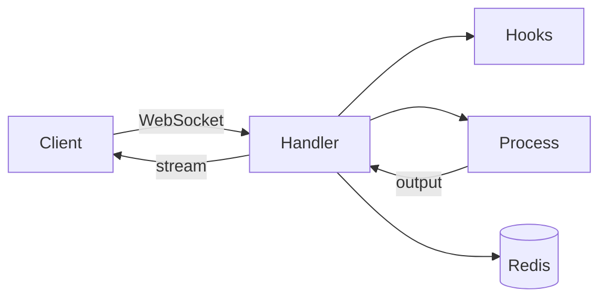

# CC Executor

**WebSocket-based sequential task execution for Claude Code** - Solves Claude's inability to respect task order when spawning sub-instances.

**Core Purpose**: Enable a Claude Orchestrator to spawn fresh Claude instances (each with 200K context) for each task, with WebSockets ensuring sequential execution.

## The Main Purpose: Orchestrator-Controlled Sequential Execution

**THE PROBLEM**: When a Claude orchestrator tries to manage multi-step tasks, it can't control execution order - tasks run in parallel, breaking dependencies.

**THE SOLUTION**: CC Executor + `cc_execute.md` enables:
- **Claude Orchestrator** manages the overall workflow
- **Fresh Claude instances** (200K context each) handle individual tasks
- **WebSockets** force the orchestrator to WAIT for each task before spawning the next

This allows Claude to:

1. **Orchestrate complex workflows** - Main Claude manages the task sequence
2. **Fresh context per task** - Each task gets a full 200K context window
3. **Guaranteed sequential execution** - Task 2 waits for Task 1 to complete
4. **No context pollution** - Each Claude instance starts clean
5. **Handle massive workflows** - 10+ hour workflows with 50+ sequential tasks
6. **True task dependencies** - Task N can use outputs from Tasks 1 through N-1

### Try It Now - Immediate Working Example

```bash
# Quick start - Run working examples
cc-executor server start  # Start the WebSocket server

# Basic example - All tasks use cc_execute
cd examples/basic_usage
python run_example.py

# Advanced example - Mixed execution patterns  
cd examples/advanced_usage
python run_example.py
```

**Example Task Lists**:

Basic Usage (all cc_execute):
```
Task 1: Create TODO API → Fresh 200K context
Task 2: Write tests → New context, reads Task 1's output  
Task 3: Add feature → Clean context, builds on previous work
```

Advanced Usage (mixed patterns):
```
Task 1: Research (Direct) → Quick MCP tool call
Task 2: Create Tutorial (cc_execute) → Complex generation  
Task 3: External Review (cc_execute) → Fresh perspective
Task 4: Create Exercises (cc_execute) → Interactive content
```

**What The Examples Demonstrate:**

Basic Usage:
- **All cc_execute**: Simple approach for learning the system
- **Sequential execution**: Each task waits for previous to complete
- **Fresh context always**: Every task gets full 200K tokens
- **Automatic UUID4**: Verification happens transparently

Advanced Usage:
- **Mixed patterns**: Optimize between direct and cc_execute
- **Tool integration**: MCP tools, external models
- **Smart selection**: Use cc_execute only when beneficial
- **Real workflows**: Research → Build → Review → Improve

> **Note**: See the `examples/` directory for complete working examples:
> - `examples/basic_usage/` - Learn cc_execute fundamentals
> - `examples/advanced_usage/` - Production patterns with mixed execution
> - `docs/GAMIFICATION_EXPLAINED.md` - Understanding self-improving features

### For Advanced Users - Full Workflow Example

See `examples/redis_cache_advanced_task_list.md` for a complete Research → Build → Review → Improve workflow that demonstrates:
- Integration with perplexity-ask for research
- Building based on researched best practices
- AI model review with LiteLLM
- Iterative improvement based on feedback

This shows the FULL power of orchestrated task execution with external tools.

### Advanced Example - Research + Build + Review

```bash
# Advanced workflow with external tools (simplified view)
Task 1: Research with perplexity-ask → Save findings
Task 2: Build Redis cache based on research → Fresh context
Task 3: Review code with LiteLLM/Gemini → Fresh perspective  
Task 4: Apply improvements and test → Final iteration

# Full orchestrated example in: examples/redis_cache_advanced_task_list.md
```

**The Magic**: 
- **Orchestrator Claude**: Manages workflow, tracks progress, handles errors
- **Worker Claudes**: Fresh 200K context each, focused on single tasks
- **WebSocket**: Forces orchestrator to wait between spawning instances

## Why This Exists

Beyond sequential execution, this project provides a reliable Claude Code SDK that:
- **Implements a working hook system** (addressing challenges with the official hook implementation)
- **Works with Claude Max** ($200/month Claude Max subscribers)
- **Allows Claude Code to be called programmatically** without hanging
- **Provides consistent subprocess execution** that doesn't mysteriously fail
- **Works around known Claude CLI limitations** (like the missing `--print` flag bug)

The official SDK currently focuses on API-key workflows and does not support browser-authenticated Claude Max users, so they can't:
- Use the API (Claude Max uses browser auth, not API keys)
- Run hooks reliably (implementation challenges exist)
- Integrate Claude into any automated workflow

After extensive testing with these limitations, this WebSocket-based approach emerged as a reliable way to integrate Claude Code.

**I hope Anthropic will eventually provide full official support for Claude Max subscribers, making this community workaround unnecessary.** Until then, this project aims to fill the gap.

*— A Claude Max user (ok, it's me)*

## Quick Usage Example - Task Lists Only!

```python
from cc_executor import cc_execute_task_list

# CC Executor is for MULTI-STEP workflows, not single calls
tasks = [
    "Task 1: Create the FastAPI app structure with routers",
    "Task 2: Add SQLAlchemy models and database setup", 
    "Task 3: Implement CRUD endpoints for users",
    "Task 4: Add authentication middleware",
    "Task 5: Write comprehensive tests"
]

results = cc_execute_task_list(tasks)
```

**❌ DON'T DO THIS:**
```python
# WRONG - Don't use CC Executor for single tasks!
result = some_single_claude_call("Write a function")  # Just use claude -p
```

## Overview

CC Executor is an unofficial Python SDK and WebSocket service for Claude Code Max users. It provides a flexible, optional execution pattern (like numpy vs math) for complex tasks that need fresh context isolation.

## Core Features

- **Sequential task execution** - WebSockets maintain persistent connections for multi-step workflows
- **Optional execution pattern** - Use cc_execute when you need it, direct execution when you don't
- **Automatic UUID4 verification** - Built-in anti-hallucination hooks (always enabled)
- **WebSocket JSON-RPC server** (`src/cc_executor/core/websocket_handler.py`) – reliable streaming command execution.
- **Async Python client SDK** (`src/cc_executor/client/client.py`) – programmatic access for Python scripts.
- **Automatic hooks** - UUID4 injection and verification happens transparently
- **Token-limit detection & adaptive retry** (logic in `websocket_handler.py` - detects multiple token limit patterns).
- **Redis-backed session state & execution history** (`src/cc_executor/core/session_manager.py` - fully implemented with Redis support).
- **Shell consistency with Claude Code** (default shell configured in `src/cc_executor/core/config.py`).

### Comparison with Official Anthropic SDK

| Capability | CC Executor (Unofficial SDK) | Official Anthropic SDK |
|------------|------------------------------|------------------------|
| Sequential multi-step task execution | ✅ (via persistent WebSocket) | ❌ |
| Works with Claude Max (browser-auth) | ✅ | ❌ |
| Python async client & CLI | ✅ `client/client.py`, `cli/main.py` | ❌ (API only) |
| WebSocket streaming JSON-RPC | ✅ `core/websocket_handler.py` | ❌ |
| Automatic UUID4 hooks | ✅ Always enabled | ❌ (hooks broken) |
| Optional execution pattern | ✅ Use when needed | N/A |
| Token-limit detection & adaptive retry | ✅ | ❌ |
| Redis-backed session & history | ✅ `core/session_manager.py` | ❌ |
| Shell consistency (`zsh`) | ✅ | N/A |

## Architecture

The project follows a clean, self-contained directory structure:

```
src/cc_executor/
├── core/           # Core server implementation
│   ├── websocket_handler.py    # Main WebSocket server
│   ├── process_manager.py      # Subprocess execution management
│   ├── stream_handler.py       # Output stream handling
│   ├── resource_monitor.py     # Resource monitoring
│   └── client.py              # WebSocket client for connecting to server
├── cli/            # Command-line interface
│   └── main.py                # Typer-based CLI with all commands
├── hooks/          # Hook system for extensibility
│   ├── hook_integration.py    # Main hook integration (ProgrammaticHookEnforcement)
│   ├── setup_environment.py    # Environment setup hooks
│   ├── record_execution_metrics.py # Execution metrics recording
│   └── review_code_changes.py  # Code review hooks
└── templates/      # Self-improving prompt templates
```

### How It Works



**Execution Flow:**
1. Client connects via WebSocket and sends command
2. Pre-execution hooks validate and wrap the command  
3. Redis provides timeout estimates from historical data
4. ProcessManager spawns subprocess with proper isolation
5. Output streams in real-time to client
6. Post-execution hooks update metrics in Redis

## Installation

```bash
# Clone the repository
git clone https://github.com/grahama1970/cc_executor.git
cd cc_executor

# Create virtual environment and install dependencies
uv sync

# Install for development
uv pip install -e .
```

## When to Use cc_execute vs Direct Execution

Think of cc_execute like numpy - you don't need it for simple math, but it's invaluable for complex operations:

### Use Direct Execution When:
- **Simple tool calls**: MCP tools like perplexity-ask, GitHub operations
- **Quick queries**: Tasks under 30 seconds
- **No isolation needed**: When context accumulation is beneficial
- **Basic commands**: File reads, simple edits, status checks

### Use cc_execute When:
- **Fresh context needed**: Each task needs full 200K token window
- **Complex generation**: Multi-file creation, architecture design
- **Long-running tasks**: Operations over 1 minute (WebSocket keeps alive)
- **Anti-hallucination critical**: Automatic UUID4 verification
- **Task isolation required**: No pollution from previous operations

### Example: Mixed Execution Pattern
```bash
# Task 1: Direct - Quick MCP tool call
Use perplexity-ask to research Redis caching patterns

# Task 2: cc_execute - Complex implementation
Using cc_execute.md: Create a Redis cache module with connection pooling,
error handling, and automatic retry logic based on the research

# Task 3: cc_execute - External review  
Using cc_execute.md: Review the implementation with gemini-2.0-flash-exp
via LiteLLM and suggest improvements

# Task 4: Direct - Simple test run
Run pytest on the generated tests
```

## Advanced Workflow Examples (Task List Context)

**Note**: These examples show cc_execute.md in its proper context - orchestrating multi-step task lists. For single commands, just use Claude Code directly.

### 1. Research → Build → Review Pipeline (Multi-Task Orchestration)

Orchestrate a complete workflow where each task gets fresh context:

```bash
# Task List: Build Quantum Computing Tutorial
cc-executor run "claude -p 'You are the ORCHESTRATOR. Execute this task list:

Task 1 (Direct): Use perplexity-ask to research quantum entanglement breakthroughs from 2024-2025

Task 2 (cc_execute.md): Based on the research, create a beginner-friendly tutorial on quantum 
entanglement with code examples in Python. Save as quantum_tutorial.md

Task 3 (cc_execute.md): Review the tutorial and create interactive Jupyter notebook exercises 
that demonstrate the concepts. Each exercise should build on the previous one.'"
```

### 2. Sequential Implementation with External Review (Task List)

Build complex systems where each component needs fresh context:

```bash
# Task List: Build Secure API with Authentication
cc-executor run "claude -p 'ORCHESTRATE these sequential tasks:

Task 1 (cc_execute.md): Create a FastAPI application structure with proper project layout,
dependency injection, and configuration management. Include a main.py and config.py

Task 2 (cc_execute.md): Add JWT-based user authentication to the FastAPI app. Include 
registration, login, and protected endpoints. Implement proper password hashing.

Task 3 (cc_execute.md): Review the complete implementation using ./prompts/ask-litellm.md 
with gemini-2.0-flash-exp to identify security vulnerabilities and suggest improvements.

Task 4 (cc_execute.md): Implement the security improvements suggested in Task 3 and add 
comprehensive test coverage for all authentication flows.'"
```

### 3. Parallel Generation Followed by Sequential Analysis (Task List)

Combine parallel and sequential patterns in a workflow:

```bash
# Task List: Algorithm Implementation Comparison
cc-executor run "claude -p 'ORCHESTRATE this workflow:

Phase 1 - Parallel Generation (Direct):
Spawn 3 parallel tasks to implement binary search:
- Task A: Iterative implementation with performance focus
- Task B: Recursive implementation with clarity focus  
- Task C: Generic implementation supporting any comparable type

Phase 2 - Sequential Analysis (cc_execute.md):
Task 4: Analyze all three implementations for time/space complexity and create a 
comparison table. Include Big-O analysis and practical performance considerations.

Task 5: Create a comprehensive test suite that validates all three implementations
with edge cases, large datasets, and different data types.

Task 6: Write a technical blog post explaining when to use each implementation,
with benchmarks and real-world examples.'"
```

## Usage

### Command Line Interface

CC Executor provides a comprehensive CLI with the following commands:

```bash
# Start the server
cc-executor server start

# Check server status
cc-executor server status

# Execute a command
cc-executor run "echo Hello, World!"

# Run Claude commands with automatic retry
cc-executor run "claude -p 'What is 2+2?'"

# View execution history
cc-executor history list

# Run assessments
cc-executor test assess core

# Initialize environment
cc-executor init
```

### Programmatic Usage

```python
from cc_executor.core.client import WebSocketClient
import asyncio

async def main():
    client = WebSocketClient()
    
    # Execute a command
    result = await client.execute_command(
        command='echo "Hello from Python!"',
        timeout=30
    )
    
    if result["success"]:
        print(f"Output: {result['output_data']}")
    else:
        print(f"Error: {result['error']}")

asyncio.run(main())
```

## Orchestration and Tool Integration

CC Executor works best as a **prompt-based tool** using `cc_execute.md`. After exploring MCP integration, we determined that the prompt-based approach is superior for this use case.

### Why Prompts Over MCP

1. **Proven Reliability**: 10:1 success ratio with prompt-based approach
2. **Simplicity**: No additional servers, protocols, or dependencies
3. **Flexibility**: Prompts can evolve and self-improve
4. **No Added Value**: MCP would add complexity without solving real problems

### For Orchestrators

If you need an orchestrator to use multiple tools (cc_execute, perplexity-ask, etc.), use structured prompts:

```markdown
## Task Execution Plan

1. Implementation Phase:
   - Use cc_execute.md: "Create a FastAPI app with user authentication"
   - Timeout: 300s
   - Tools: Read, Write, Edit, Bash

2. Research Phase:
   - Use perplexity-ask: "Latest FastAPI security best practices"

3. Review Phase:
   - Use Claude task tool: "Review the generated code"
```

This gives you structure and flexibility without brittleness.

See [MCP Evaluation Result](docs/MCP_EVALUATION_RESULT.md) for the full analysis.

## Key Features

### Shell Consistency with Claude Code
- **Configurable shell preference** (zsh, bash, or system default)
- **Defaults to zsh** for consistency with Claude Code execution
- Ensures command parsing and environment behavior matches Claude's environment
- Eliminates shell-specific edge cases and improves reliability

### Token Limit Detection
- Automatically detects when Claude hits output token limits
- Provides adaptive retry strategies with more concise prompts
- Sends real-time notifications via WebSocket

### Automatic Hook System
- **UUID4 anti-hallucination**: Always enabled, no configuration needed
- **Pre-execution hooks**: Automatically inject UUID4 requirements
- **Post-execution hooks**: Verify UUID4 presence in outputs
- **Transparent operation**: Hooks run automatically with cc_execute
- **Error recovery**: Built-in retry logic (3 attempts)

### Self-Improving Assessments
- Each major directory has self-assessment capabilities
- Behavioral testing (not regex-based)
- Saves raw outputs to prevent AI hallucination
- Generates comprehensive markdown reports
- UUID4 verification prevents fabricated results

### WebSocket Protocol
- JSON-RPC 2.0 based communication
- Streaming output support with 64KB chunking for large outputs
- Bidirectional error notifications
- Session management with Redis
- Proper subprocess buffer management (8MB limit)

### Memory-Efficient Streaming
- `PYTHONUNBUFFERED=1` for real-time output streaming
- Async streaming prevents memory accumulation
- Chunked WebSocket transmission for large outputs
- Configurable buffer limits and timeouts

## Configuration

Create a `.env` file in the project root:

```bash
# API Keys
ANTHROPIC_API_KEY=your_key_here

# Redis Configuration
REDIS_URL=redis://localhost:6379

# CC Executor Settings
CC_EXECUTOR_PORT=8003
CC_EXECUTOR_HOST=0.0.0.0
LOG_LEVEL=INFO

# Shell Configuration (optional)
CC_EXECUTOR_SHELL=zsh  # Options: zsh, bash, default
# Defaults to zsh for Claude Code consistency

# Process Configuration (optional)
PYTHONUNBUFFERED=1  # Ensures real-time output streaming
STREAM_TIMEOUT=600  # Stream timeout in seconds (default: 10 minutes)
MAX_BUFFER_SIZE=8388608  # Max buffer size in bytes (default: 8MB)
```

## Development

### Running Tests

```bash
# Run all tests
uv run pytest

# Run usage function assessments
cc-executor test assess core
cc-executor test assess cli
cc-executor test assess hooks

# Run stress tests
cc-executor test stress --tasks 10 --parallel 2
```

### Adding Hooks

Create a new hook file in the `hooks/` directory:

```python
from cc_executor.hooks.hook_types import HookContext, HookResult

async def my_custom_hook(context: HookContext) -> HookResult:
    # Your hook logic here
    return HookResult(proceed=True, message="Hook executed")

# Register the hook
HOOKS = {
    "pre_execution": [my_custom_hook]
}
```

## Problems This Solves

### Claude Max ($200/month) Limitations
- **No API access**: Claude Max uses browser auth, API keys don't work
- **Broken hooks**: The hook system is completely non-functional
- **No SDK support**: The official SDK ignores Claude Max users entirely
- **Can't automate**: No way to integrate into workflows despite paying premium

### Claude CLI Issues
- **The `-p` flag confusion**: Claude CLI uses `-p` not `--print`, but this isn't documented
- **Subprocess hanging**: Direct subprocess calls to Claude often hang indefinitely
- **Hook execution failures**: Hooks don't run reliably when called programmatically
- **No real SDK**: No official Python SDK for Claude Code exists

### Our Solution
- **WebSocket-based architecture**: Reliable bidirectional communication
- **Proper subprocess management**: Process groups, timeouts, and graceful termination
- **Hook integration that works**: Pre/post execution hooks run consistently
- **Real streaming**: Output streams in real-time, not after completion
- **Claude Max compatible**: Works with browser-authenticated Claude sessions

## Recent Improvements (2025-07-03)

### Core Enhancements
- **Zsh Shell Support**: Now uses zsh by default for consistency with Claude Code
- **Configurable Shell**: Environment variable `CC_EXECUTOR_SHELL` for shell preference
- **Memory Optimization**: Improved streaming with proper buffer management
- **Better Error Detection**: Enhanced token limit and rate limit detection
- **Project Cleanup**: Reorganized ~400+ files for better maintainability

### Technical Improvements
- Subprocess execution now uses `asyncio.create_subprocess_exec` with explicit shell
- 8MB buffer limits prevent memory issues with large outputs
- 64KB WebSocket chunking for reliable transmission
- `PYTHONUNBUFFERED=1` ensures real-time output visibility

## Architecture Principles

1. **Self-Contained Directories**: Each directory has all its dependencies
2. **Clear Responsibilities**: Each component has one clear purpose
3. **No Cross-Cutting Dependencies**: Components don't reach across directories
4. **Behavioral Testing**: Tests verify behavior, not implementation details
5. **Raw Output Saving**: All components save outputs to prevent hallucination
6. **Shell Consistency**: Use the same shell as Claude Code for reliability

## Contributing

1. Follow the existing architecture patterns
2. Add usage functions to all new Python files
3. Create self-assessment prompts for new directories
4. Save raw outputs in `tmp/responses/`
5. Use behavioral testing, not regex matching

## License

GPL-3.0-or-later