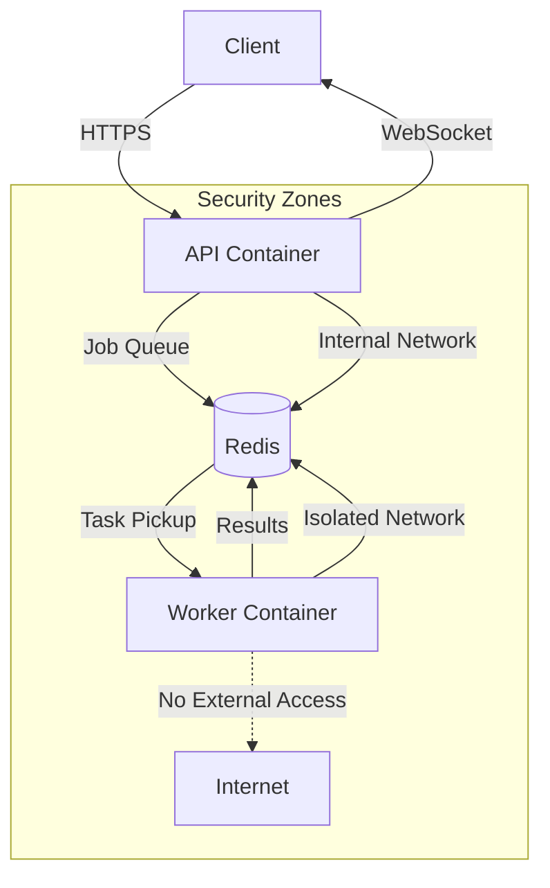

# Secure Docker Deployment Guide - CC Executor

## Overview

This guide describes how to deploy CC Executor with enhanced security for safe code execution in containerized environments.

## Architecture



## Components

### 1. **API Container** (`cc_executor_api`)
- Handles client requests
- Manages authentication
- Queues tasks in Redis
- Streams results via WebSocket

### 2. **Worker Container** (`cc_executor_worker`)
- Picks up tasks from Redis queue
- Executes in isolated environment
- No external network access
- Strict resource limits
- Temporary filesystem only

### 3. **Redis Container** (`cc_executor_redis`)
- Task queue management
- Result storage
- Inter-container communication

## Security Features

### Container Isolation
- Separate containers for API and execution
- Read-only root filesystems
- Minimal attack surface

### Resource Limits
```yaml
pids_limit: 50          # Prevent fork bombs
mem_limit: 1g           # Memory limit
cpus: "0.5"            # CPU limit
```

### Filesystem Security
- Execution in tmpfs (RAM disk)
- Size-limited temporary directories
- No persistent storage in worker

### Network Security
- Worker has no external network access
- Internal-only network for Redis
- Localhost-only port binding

### Process Security
- Dropped capabilities
- No new privileges
- Separate user accounts
- Process group isolation

## Deployment Steps

### 1. Prerequisites
```bash
# Install Docker and Docker Compose
curl -fsSL https://get.docker.com | sh
sudo usermod -aG docker $USER

# Create required directories
mkdir -p deployment/worker_output
mkdir -p deployment/logs
```

### 2. Build Images
```bash
# Build all images
docker compose -f docker-compose.secure.yml build
```

### 3. Start Services
```bash
# Start in detached mode
docker compose -f docker-compose.secure.yml up -d

# Check status
docker compose -f docker-compose.secure.yml ps
```

### 4. Verify Health
```bash
# Check API health
curl http://localhost:8001/health

# Check Redis
docker compose -f docker-compose.secure.yml exec redis redis-cli ping

# View logs
docker compose -f docker-compose.secure.yml logs -f
```

## Usage

### 1. Submit a Task
```python
import httpx
import asyncio

async def submit_task():
    async with httpx.AsyncClient() as client:
        response = await client.post(
            "http://localhost:8001/execute",
            json={
                "tasks": ["echo 'Hello from secure container'"],
                "timeout_per_task": 30
            }
        )
        return response.json()

result = asyncio.run(submit_task())
print(result)
```

### 2. Monitor Execution
```python
# WebSocket connection for real-time updates
import websockets
import json

async def monitor_execution(execution_id):
    uri = f"ws://localhost:8003/ws"
    async with websockets.connect(uri) as websocket:
        # Subscribe to execution
        await websocket.send(json.dumps({
            "action": "subscribe",
            "execution_id": execution_id
        }))
        
        # Receive updates
        async for message in websocket:
            data = json.loads(message)
            print(f"Update: {data}")
```

## Security Best Practices

### 1. **Input Validation**
- Sanitize all user inputs
- Limit command complexity
- Validate task parameters

### 2. **Output Handling**
- Limit output size
- Sanitize output content
- Monitor for sensitive data

### 3. **Monitoring**
- Enable audit logging
- Monitor resource usage
- Set up alerts for anomalies

### 4. **Updates**
- Regularly update base images
- Apply security patches
- Review security configurations

## Troubleshooting

### Worker Not Processing Tasks
```bash
# Check worker logs
docker compose -f docker-compose.secure.yml logs worker

# Check Redis queue
docker compose -f docker-compose.secure.yml exec redis redis-cli LLEN cc_executor:task_queue
```

### Permission Errors
```bash
# Fix volume permissions
sudo chown -R $USER:$USER deployment/worker_output deployment/logs
```

### Resource Limits Hit
```bash
# Check container stats
docker stats cc_executor_worker

# Adjust limits in docker-compose.secure.yml if needed
```

## Production Considerations

### 1. **TLS/HTTPS**
- Use reverse proxy (nginx/traefik) for TLS
- Secure WebSocket connections (wss://)
- Client certificate authentication

### 2. **Scaling**
- Multiple worker containers
- Redis Sentinel for HA
- Load balancer for API

### 3. **Monitoring**
- Prometheus metrics
- ELK stack for logs
- Grafana dashboards

### 4. **Backup**
- Redis persistence
- Log rotation
- Result archival

## Security Checklist

- [ ] Images built from secure base
- [ ] No secrets in images
- [ ] Resource limits configured
- [ ] Network isolation verified
- [ ] Audit logging enabled
- [ ] Monitoring configured
- [ ] Update schedule defined
- [ ] Incident response plan

## Conclusion

This secure deployment provides multiple layers of defense for safe code execution. Regular security reviews and updates are essential for maintaining security posture.