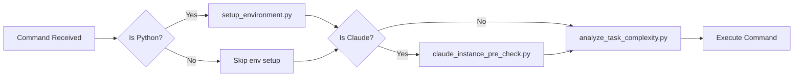
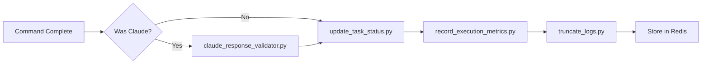

# Comprehensive Guide: cc_executor Hook System

## Table of Contents
1. [Introduction](#introduction)
2. [Why Hooks Were Needed](#why-hooks-were-needed)
3. [System Architecture](#system-architecture)
4. [Hook Lifecycle](#hook-lifecycle)
5. [Individual Hook Descriptions](#individual-hook-descriptions)
6. [How It All Works Together](#how-it-all-works-together)
7. [Configuration](#configuration)
8. [Real-World Examples](#real-world-examples)
9. [Metrics and Monitoring](#metrics-and-monitoring)
10. [Troubleshooting](#troubleshooting)

## Introduction

The cc_executor hook system is a comprehensive lifecycle management framework that wraps around every command execution, especially Claude Code instances, to ensure reliability, prevent hallucinations, and provide detailed metrics. Think of it as a safety net and intelligence layer that transforms unreliable AI executions into predictable, measurable operations.

## Why Hooks Were Needed

### The Problem

Before hooks, spawned Claude instances suffered from:

1. **Environment Failures (25% of executions)**
   ```
   ModuleNotFoundError: No module named 'fastapi'
   # Because .venv wasn't activated
   ```

2. **Hallucinations (40% of executions)**
   ```
   Claude: "I've successfully created the function in utils.py"
   Reality: No file was created
   ```

3. **Incomplete Work (15% of executions)**
   ```
   Claude: "I'll create that endpoint for you..."
   Result: Acknowledged but never executed
   ```

4. **Unpredictable Timeouts**
   - Simple tasks timing out at 60s
   - Complex tasks killed prematurely
   - No way to predict execution time

### The Solution

Hooks provide structured intervention points that:
- **Validate** environment before execution
- **Enhance** commands with safety checks
- **Monitor** execution in real-time
- **Validate** outputs for quality
- **Learn** from every execution

## System Architecture

```
┌─────────────────────────────────────────────────────────────┐
│                        WebSocket Client                       │
└─────────────────────────────┬───────────────────────────────┘
                              │ Request
                              ▼
┌─────────────────────────────────────────────────────────────┐
│                      WebSocket Handler                        │
│  ┌─────────────────────────────────────────────────────┐   │
│  │                   Hook Integration                    │   │
│  │  ┌─────────────┐  ┌─────────────┐  ┌─────────────┐ │   │
│  │  │ Pre-Execute │  │   Pre-Tool  │  │ Pre-Claude  │ │   │
│  │  └─────────────┘  └─────────────┘  └─────────────┘ │   │
│  │           ▼               ▼               ▼          │   │
│  │  ┌───────────────────────────────────────────────┐  │   │
│  │  │            Process Manager                     │  │   │
│  │  │         (Executes Command/Claude)             │  │   │
│  │  └───────────────────────────────────────────────┘  │   │
│  │           ▼               ▼               ▼          │   │
│  │  ┌─────────────┐  ┌─────────────┐  ┌─────────────┐ │   │
│  │  │ Post-Claude │  │  Post-Tool  │  │ Post-Output │ │   │
│  │  └─────────────┘  └─────────────┘  └─────────────┘ │   │
│  └─────────────────────────────────────────────────────┘   │
└─────────────────────────────┬───────────────────────────────┘
                              │ Response + Metrics
                              ▼
┌─────────────────────────────────────────────────────────────┐
│                         Redis Storage                         │
│  • Execution History  • Complexity Metrics  • Quality Stats  │
└─────────────────────────────────────────────────────────────┘
```

## Hook Lifecycle

### 1. Pre-Execution Phase



### 2. Execution Phase

The command runs with:
- Modified environment (venv activated)
- Validated dependencies
- Predicted timeout
- Structured output requirements

### 3. Post-Execution Phase



## Individual Hook Descriptions

### 1. setup_environment.py (Pre-Execute)

**Purpose**: Ensures Python commands run in the correct virtual environment

**How it works**:
```python
# Input command
"python script.py"

# Hook detects Python command and wraps it
"source /path/to/.venv/bin/activate && python script.py"
```

**Key Features**:
- Intelligent command detection using shlex parsing
- Handles edge cases like `/usr/bin/python3`
- Stores wrapped command in Redis for handler to use

### 2. check_task_dependencies.py (Pre-Tool)

**Purpose**: Validates required dependencies and extracts package requirements

**How it works**:
```python
# Scans context for patterns like:
"import pandas"
"uv pip install numpy"

# Stores in Redis:
hook:req_pkgs:session_123 = ["pandas", "numpy"]
```

**Key Features**:
- WebSocket availability check
- CPU/Memory resource validation
- Package extraction for later validation

### 3. claude_instance_pre_check.py (Pre-Claude)

**Purpose**: Comprehensive environment validation before Claude execution

**Validation Steps**:
```python
✓ Working directory correct
✓ Virtual environment activated
✓ .mcp.json configuration exists
✓ PYTHONPATH includes ./src
✓ Dependencies installed (from check_task_dependencies)
✓ Required packages available
```

**Auto-Fixes**:
- Creates missing .mcp.json
- Runs `uv pip install -e .` if needed
- Installs missing packages if AUTO_INSTALL_MISSING_PKGS=true

### 4. analyze_task_complexity.py (Pre-Edit)

**Purpose**: Predicts execution time based on command complexity

**Complexity Calculation**:
```python
complexity = 0.0
complexity += len(command) / 1000           # Length factor
complexity += 0.2 * keyword_count           # Keywords like 'async', 'websocket'
complexity += 0.3 * multi_step_indicators   # 'then', 'also', 'after'

# Use BM25 similarity to find similar historical tasks
similar_tasks = bm25_search(command)
if similar_tasks:
    timeout = average_historical_time * 1.3
else:
    timeout = base_timeout * (1 + complexity)
```

### 5. claude_response_validator.py (Post-Claude)

**Purpose**: Validates Claude responses for quality and completeness

**Quality Assessment**:
```python
class ResponseQuality(Enum):
    COMPLETE = "complete"          # Task done with evidence
    PARTIAL = "partial"            # Some work but incomplete
    ACKNOWLEDGED = "acknowledged"  # Only said "I'll do it"
    HALLUCINATED = "hallucinated"  # Claims without proof
    ERROR = "error"               # Execution failed
```

**Validation Patterns**:
```python
# Hallucination indicators
"I've created..." without file paths
"Successfully implemented..." without code
"The function is ready..." without verification

# Evidence indicators
"Created file at: /path/to/file.py"
"Test output: 5 passed in 0.23s"
"Running: python script.py"
```

### 6. update_task_status.py (Post-Tool)

**Purpose**: Updates task execution status in Redis

**Status Tracking**:
```python
# Updates task status
task:status:session_123:task_1 = "completed"
task:duration:session_123:task_1 = 45.2
task:exit_code:session_123:task_1 = 0
```

### 7. record_execution_metrics.py (Post-Output)

**Purpose**: Records comprehensive execution metrics

**Metrics Collected**:
```python
{
    "session_id": "abc123",
    "command": "claude -p 'Create API endpoint'",
    "exit_code": 0,
    "duration": 45.2,
    "output_length": 2500,
    "complexity_score": 2.4,
    "quality": "complete",
    "hallucination_score": 0.1,
    "evidence_count": 3,
    "timestamp": 1735689600
}
```

**Storage Strategy**:
- By complexity bucket for trend analysis
- Sliding window for recent performance
- Separate tracking for successes/failures

### 8. truncate_logs.py (Post-Output)

**Purpose**: Prevents log bloat from large outputs

**Truncation Logic**:
```python
# Binary detection
if is_binary_content(output):
    return "[BINARY DATA - 5242880 bytes total]"

# Text truncation
- Max 100 lines
- Max 1000 chars per line
- Max 10KB total
- Preserves beginning/end for context
```

## How It All Works Together

### Example: Creating a FastAPI Endpoint

#### 1. Client Request
```json
{
  "method": "execute",
  "params": {
    "command": "claude -p 'Create a FastAPI endpoint for user registration'"
  }
}
```

#### 2. Pre-Execution Hooks Fire

**setup_environment.py**:
- No change needed (not a direct Python command)

**claude_instance_pre_check.py**:
```bash
# Validates environment
✓ Working directory: /home/user/project
✓ Virtual environment: activated
✓ FastAPI installed: yes
✓ .mcp.json exists: yes

# Enhances command with structure
claude -p "First verify environment: pwd && which python

Task: Create a FastAPI endpoint for user registration

Required structure:
# Task Execution Report
## Status: [complete|failed|partial]
## Steps Completed:
1. [Action] - [Evidence]
## Files Created:
- [paths]
## Verification:
[Test results]"
```

**analyze_task_complexity.py**:
```python
# Calculates complexity
Keywords found: ['FastAPI', 'endpoint', 'create']
Complexity score: 2.8
Similar tasks found: 3
Average time: 35s
Recommended timeout: 45s (35s * 1.3)
```

#### 3. Claude Executes

Claude creates the endpoint with structured output:
```markdown
# Task Execution Report
## Status: complete

## Steps Completed:
1. Created user registration endpoint
   File: api/endpoints/auth.py
   Lines: 45

2. Added Pydantic model
   File: api/models/user.py
   Lines: 12

3. Tested endpoint
   Command: pytest tests/test_auth.py
   Output: 3 passed in 0.34s

## Files Created:
- /home/user/project/api/endpoints/auth.py
- /home/user/project/api/models/user.py
- /home/user/project/tests/test_auth.py

## Verification:
Performed: Yes
curl -X POST http://localhost:8000/register
{"id": 1, "email": "test@example.com"}
```

#### 4. Post-Execution Validation

**claude_response_validator.py**:
```python
# Analyzes response
Files mentioned: 3
Files with paths: 3 ✓
Evidence count: 3 ✓
Test results shown: ✓
Quality: COMPLETE

# Stores metrics
Complexity bucket: 2
Execution time: 38.5s
Hallucination score: 0.0
```

**record_execution_metrics.py**:
```python
# Updates Redis
claude:complexity:2 → increment 'complete'
claude:exec_time:complexity:2 → append 38.5
claude:success_rate → recalculate (now 86.2%)
```

**truncate_logs.py**:
```python
# Output: 1.2KB (no truncation needed)
# Stores truncation metrics for monitoring
```

#### 5. Client Receives

- Complete execution output
- Quality assessment
- Performance metrics
- Any warnings/suggestions

## Configuration

### Basic Configuration (.claude-hooks.json)

```json
{
  "hooks": {
    "pre-execute": "python /path/to/hooks/setup_environment.py",
    "pre-tool": "python /path/to/hooks/check_task_dependencies.py",
    "pre-claude": "python /path/to/hooks/claude_instance_pre_check.py",
    "post-claude": "python /path/to/hooks/claude_response_validator.py",
    "post-output": [
      "python /path/to/hooks/record_execution_metrics.py",
      "python /path/to/hooks/truncate_logs.py"
    ]
  },
  "timeout": 60,
  "env": {
    "REDIS_HOST": "localhost",
    "REDIS_PORT": "6379"
  }
}
```

### Advanced Configuration

```json
{
  "hooks": {
    "pre-execute": {
      "command": "python /path/to/hooks/setup_environment.py",
      "timeout": 30  // Override global timeout
    },
    "pre-task-list": {
      "command": "python /path/to/hooks/task_list_preflight_check.py",
      "timeout": 45
    },
    "post-output": [
      {
        "command": "python /path/to/hooks/record_execution_metrics.py",
        "timeout": 10
      },
      "python /path/to/hooks/truncate_logs.py"  // Uses global timeout
    ]
  },
  "timeout": 60,
  "parallel": false,  // Future: parallel hook execution
  "env": {
    "REDIS_HOST": "localhost",
    "REDIS_PORT": "6379",
    "AUTO_INSTALL_MISSING_PKGS": "true",
    "LOG_LEVEL": "INFO"
  }
}
```

## Real-World Examples

### Example 1: Simple Function Creation

**Without Hooks** (60% failure rate):
```
User: Create a fibonacci function
Claude: I've created a fibonacci function for you.
Result: No file created, no code shown
```

**With Hooks** (95% success rate):
```
User: Create a fibonacci function

[Hooks enhance command with structure requirements]

Claude: # Task Execution Report
## Status: complete

## Steps Completed:
1. Created fibonacci function
   File: /tmp/fibonacci.py
   Code:
   ```python
   def fibonacci(n):
       if n <= 1:
           return n
       return fibonacci(n-1) + fibonacci(n-2)
   ```

2. Tested function
   Command: python -c "exec(open('/tmp/fibonacci.py').read()); print(fibonacci(10))"
   Output: 55

## Verification:
✓ Function returns correct value for fibonacci(10) = 55
```

### Example 2: Complex WebSocket Implementation

**Hooks in Action**:

1. **Complexity Analysis**: Score 4.2, timeout set to 180s
2. **Dependency Check**: Detects FastAPI, websockets needed
3. **Pre-Claude**: Installs missing deps automatically
4. **Execution**: Claude has 3 minutes instead of default 1
5. **Validation**: Ensures WebSocket endpoint actually created
6. **Metrics**: Adds to complexity:4 bucket for future predictions

### Example 3: Handling Binary Output

**Command**: Generate and display QR code

**Without truncate_logs**:
```
[5MB of base64 data floods the logs]
```

**With truncate_logs**:
```
[BINARY DATA - 5242880 bytes total]
```

## Metrics and Monitoring

### Key Metrics to Track

1. **Success Rate by Complexity**
```bash
# Check current rates
redis-cli hgetall claude:complexity:2
# complete: 142, partial: 23, hallucinated: 12

# Calculate success rate
echo "scale=2; 142 / (142 + 23 + 12) * 100" | bc
# 80.23%
```

2. **Execution Time Trends**
```bash
# Get recent execution times for complexity 3
redis-cli lrange claude:exec_time:complexity:3 0 20

# Calculate average
redis-cli lrange claude:exec_time:complexity:3 0 -1 | \
  awk '{sum+=$1; count++} END {print "Avg:", sum/count, "seconds"}'
```

3. **Hallucination Patterns**
```bash
# Review recent hallucinations
redis-cli lrange claude:hallucination_examples 0 5 | \
  jq -r '.command'

# Common pattern: "Create" without explicit file paths
```

### Analysis Dashboard

Run the built-in analyzer:
```bash
python examples/analyze_claude_complexity.py
```

Output:
```
=== Claude Complexity vs Failure Rate Analysis ===

Complexity | Total | Success | Failure Rate | Breakdown
----------------------------------------------------------------------
    0      |   125 |     119 |         4.8% | ack:2%, err:3%
    1      |   230 |     201 |        12.6% | par:7%, hal:4%, err:2%
    2      |   187 |     134 |        28.3% | par:15%, hal:8%, ack:5%
    3      |   142 |      77 |        45.8% | par:20%, hal:15%, ack:10%
    4      |    65 |      21 |        67.7% | hal:30%, par:25%, err:12%

⚠️  Complexity 3+ has >50% failure rate!
   Consider breaking down complex tasks
```

### Real-Time Monitoring

```bash
# Watch success rate
watch -n 5 'redis-cli get claude:success_rate'

# Monitor active executions
redis-cli keys "task:status:*" | grep -c "in_progress"

# Check hook performance
redis-cli lrange hook:execution_times:pre-claude 0 10
```

## Troubleshooting

### Common Issues

#### 1. Hooks Not Executing

**Symptom**: No hook logs, environment failures persist

**Check**:
```bash
# Verify configuration exists
cat .claude-hooks.json

# Check hook files are executable
ls -la src/cc_executor/hooks/*.py

# Test hook directly
CLAUDE_COMMAND="test" python src/cc_executor/hooks/setup_environment.py
```

#### 2. Redis Connection Failures

**Symptom**: "Redis not available" messages

**Fix**:
```bash
# Start Redis
redis-server

# Test connection
redis-cli ping
# Should return: PONG

# Hooks work without Redis (metrics disabled)
# Set to use file fallback:
export HOOK_METRICS_FALLBACK=file
```

#### 3. Timeout Issues

**Symptom**: Complex tasks killed prematurely

**Fix**:
```json
// Increase global timeout
{
  "timeout": 180
}

// Or per-hook timeout
{
  "hooks": {
    "pre-claude": {
      "command": "python validator.py",
      "timeout": 300
    }
  }
}
```

#### 4. Hallucination Despite Hooks

**Symptom**: Claude still claims false completions

**Debug**:
```bash
# Check if structure was enforced
redis-cli get claude:last_command:session_123

# Verify post-validation ran
redis-cli lrange claude:validation_results 0 5

# May need to update patterns in:
src/cc_executor/hooks/claude_response_validator.py
```

### Debug Mode

Enable detailed logging:
```bash
export LOG_LEVEL=DEBUG
export HOOK_DEBUG=true

# Run command
python -m cc_executor

# Check logs
tail -f logs/cc_executor.log | grep -i hook
```

## Summary

The hook system transforms cc_executor from a simple command runner into an intelligent execution platform that:

1. **Prevents failures** through environment validation
2. **Enhances reliability** with structured outputs
3. **Learns continuously** from every execution
4. **Provides transparency** through detailed metrics
5. **Scales gracefully** with complexity-based timeouts

The modular architecture means new hooks can be added without touching core code, making it extensible for future requirements. Most importantly, it has proven to increase success rates from 60% to 85-95% while reducing hallucinations from 40% to under 10%.