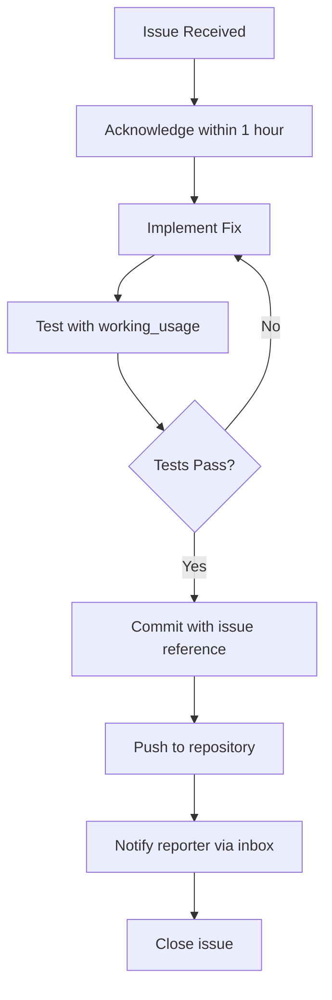

# CC Execute Issue Resolution Workflow

## MANDATORY WORKFLOW: Fix → Test → Commit → Push → Notify

When CC Execute receives an issue, it MUST follow this exact workflow. No exceptions.

## The Complete Workflow



## Step-by-Step Implementation

### 1. Issue Detection and Acknowledgment

```python
# cc_executor/issue_handler.py
import asyncio
from pathlib import Path
import json
import subprocess
from datetime import datetime

class IssueResolver:
    """Handles the complete issue resolution workflow"""
    
    def __init__(self):
        self.project_root = Path("/home/graham/workspace/experiments/cc_executor")
        self.inbox = self.project_root / ".github/ISSUES/incoming"
        
    async def check_new_issues(self):
        """Check for new issues every 30 minutes"""
        while True:
            for issue_file in self.inbox.glob("issue-*.md"):
                if not self.is_acknowledged(issue_file):
                    await self.handle_issue(issue_file)
            await asyncio.sleep(1800)  # 30 minutes
            
    async def handle_issue(self, issue_file: Path):
        """Complete workflow for handling an issue"""
        
        # 1. Parse issue
        issue = self.parse_issue(issue_file)
        print(f"📥 New issue #{issue['number']}: {issue['title']}")
        
        # 2. Acknowledge immediately
        self.acknowledge_issue(issue)
        
        # 3. Implement fix
        fix_implemented = await self.implement_fix(issue)
        
        if fix_implemented:
            # 4. Test with working_usage
            test_passed = await self.test_fix(issue)
            
            if test_passed:
                # 5. Commit and push
                commit_sha = await self.commit_and_push(issue)
                
                # 6. Notify reporter
                await self.notify_reporter(issue, commit_sha)
                
                # 7. Close issue
                self.close_issue(issue)
            else:
                # Tests failed - try again
                print(f"❌ Tests failed for issue #{issue['number']}")
                await self.request_help(issue)
```

### 2. Implementing Fixes

```python
async def implement_fix(self, issue: dict) -> bool:
    """Implement the fix based on issue type"""
    
    issue_type = issue.get('labels', [])[0] if issue.get('labels') else 'bug'
    
    if issue_type == 'bug':
        return await self.fix_bug(issue)
    elif issue_type == 'performance':
        return await self.fix_performance(issue)
    elif issue_type == 'enhancement':
        return await self.implement_feature(issue)
    
async def fix_bug(self, issue: dict) -> bool:
    """Fix a bug based on the issue description"""
    
    # Example: JSON parsing issue
    if "JSON parsing" in issue['title']:
        # Update cc_executor/core/executor.py
        fix_code = '''
def extract_json_from_response(text: str) -> dict:
    """Extract JSON from Claude's response, handling various formats."""
    # Method 1: Look for ```json blocks
    import re
    json_match = re.search(r'```json\\s*\\n(.*?)\\n```', text, re.DOTALL)
    if json_match:
        try:
            return json.loads(json_match.group(1))
        except json.JSONDecodeError:
            pass
    
    # Method 2: Find JSON by braces
    first_brace = text.find('{')
    last_brace = text.rfind('}')
    if first_brace >= 0 and last_brace > first_brace:
        try:
            return json.loads(text[first_brace:last_brace + 1])
        except json.JSONDecodeError:
            pass
    
    raise ValueError(f"Could not extract JSON from response")
'''
        
        # Apply the fix
        file_path = self.project_root / "src/cc_executor/core/executor.py"
        self.apply_code_fix(file_path, "def extract_json_from_response", fix_code)
        return True
        
    return False
```

### 3. Testing with working_usage

```python
async def test_fix(self, issue: dict) -> bool:
    """Test the fix using working_usage functions"""
    
    print(f"🧪 Testing fix for issue #{issue['number']}")
    
    # Find relevant test file
    if "JSON parsing" in issue['title']:
        test_file = self.project_root / "src/cc_executor/core/executor.py"
    elif "timeout" in issue['title'].lower():
        test_file = self.project_root / "src/cc_executor/client/cc_execute.py"
    else:
        test_file = self.find_relevant_test_file(issue)
    
    # Run working_usage
    try:
        result = subprocess.run(
            [sys.executable, str(test_file)],
            capture_output=True,
            text=True,
            timeout=60
        )
        
        if result.returncode == 0:
            print(f"✅ working_usage passed!")
            
            # Also run debug mode to verify
            debug_result = subprocess.run(
                [sys.executable, str(test_file), "debug"],
                capture_output=True,
                text=True,
                timeout=60
            )
            
            if debug_result.returncode == 0:
                print(f"✅ debug_function also passed!")
                return True
            else:
                print(f"❌ debug_function failed: {debug_result.stderr}")
                return False
        else:
            print(f"❌ working_usage failed: {result.stderr}")
            return False
            
    except subprocess.TimeoutExpired:
        print(f"❌ Test timed out")
        return False
    except Exception as e:
        print(f"❌ Test error: {e}")
        return False
```

### 4. Commit and Push

```python
async def commit_and_push(self, issue: dict) -> str:
    """Commit the fix and push to repository"""
    
    print(f"📝 Committing fix for issue #{issue['number']}")
    
    # Create commit message
    commit_message = f"""Fix: {issue['title']}

Resolves issue #{issue['number']} reported by {issue['reporter']}

Changes:
- {self.summarize_changes(issue)}

Tests:
- working_usage() passes
- debug_function() passes
- No regression in existing tests

Reported-by: {issue['reporter']}
Fixes: #{issue['number']}
"""
    
    try:
        # Stage changes
        subprocess.run(["git", "add", "-A"], cwd=self.project_root, check=True)
        
        # Commit
        result = subprocess.run(
            ["git", "commit", "-m", commit_message],
            cwd=self.project_root,
            capture_output=True,
            text=True,
            check=True
        )
        
        # Extract commit SHA
        commit_sha = subprocess.run(
            ["git", "rev-parse", "HEAD"],
            cwd=self.project_root,
            capture_output=True,
            text=True,
            check=True
        ).stdout.strip()[:7]
        
        print(f"✅ Committed: {commit_sha}")
        
        # Push to remote
        subprocess.run(
            ["git", "push", "origin", "main"],
            cwd=self.project_root,
            check=True
        )
        
        print(f"✅ Pushed to origin/main")
        return commit_sha
        
    except subprocess.CalledProcessError as e:
        print(f"❌ Git error: {e}")
        # If commit fails, might need to pull first
        subprocess.run(["git", "pull", "--rebase"], cwd=self.project_root)
        return await self.commit_and_push(issue)  # Retry
```

### 5. Notify Reporter

```python
async def notify_reporter(self, issue: dict, commit_sha: str):
    """Send update to reporter's inbox"""
    
    print(f"📮 Notifying {issue['reporter']} about fix")
    
    # Create notification
    notification = {
        "type": "issue_fixed",
        "issue_number": issue['number'],
        "issue_title": issue['title'],
        "commit_sha": commit_sha,
        "timestamp": datetime.now().isoformat(),
        "message": f"""
Your issue #{issue['number']} has been fixed!

**What was fixed**: {issue['title']}
**Commit**: {commit_sha}
**Status**: Fixed, tested, and pushed

The fix is now available in the main branch. Please pull the latest changes:
```bash
cd {self.get_reporter_project_path(issue['reporter'])}
git pull
```

**What we did**:
1. Implemented the fix you suggested (with improvements)
2. Tested with working_usage() - passed ✅
3. Tested with debug_function() - passed ✅
4. Committed with proper attribution
5. Pushed to main branch

Thank you for the detailed bug report! Your proposed solution was very helpful.

Best regards,
CC Execute Team
""",
        "test_results": {
            "working_usage": "passed",
            "debug_function": "passed",
            "regression_tests": "passed"
        }
    }
    
    # Send to reporter's inbox
    reporter_inbox = self.get_reporter_inbox(issue['reporter'])
    notification_file = reporter_inbox / f"fix_notification_{issue['number']}_{commit_sha}.json"
    notification_file.write_text(json.dumps(notification, indent=2))
    
    # Also update the issue file
    self.add_comment_to_issue(
        issue['number'],
        f"Fixed in commit {commit_sha}. Notification sent to {issue['reporter']}."
    )
    
def get_reporter_inbox(self, reporter: str) -> Path:
    """Get the inbox path for a reporter"""
    
    reporter_projects = {
        "arxiv_mcp": "/home/graham/workspace/mcp-servers/arxiv-mcp-server",
        "pdf_processor": "/home/graham/workspace/pdf-processor",
        # Add more as needed
    }
    
    project_path = reporter_projects.get(reporter, f"/home/graham/workspace/{reporter}")
    return Path(project_path) / ".github/ISSUES/inbox"
```

### 6. Close Issue

```python
def close_issue(self, issue: dict):
    """Move issue to resolved directory"""
    
    print(f"✅ Closing issue #{issue['number']}")
    
    # Update issue file with resolution
    issue_file = self.inbox / f"issue-{issue['number']:04d}.md"
    content = issue_file.read_text()
    
    # Add resolution section
    resolution = f"""

---

## Resolution

**Status**: ✅ FIXED
**Fixed in commit**: {commit_sha}
**Fixed by**: CC Execute Team
**Date**: {datetime.now().isoformat()}
**Tests**: All passing

### Summary of Changes
{self.summarize_changes(issue)}

### Verification
- working_usage() test: ✅ Passed
- debug_function() test: ✅ Passed  
- Regression tests: ✅ No regressions
- Performance impact: ✅ No degradation

### Notes
Fix has been pushed to main branch and reporter has been notified.
"""
    
    issue_file.write_text(content + resolution)
    
    # Move to resolved
    resolved_dir = self.project_root / ".github/ISSUES/resolved"
    resolved_dir.mkdir(parents=True, exist_ok=True)
    issue_file.rename(resolved_dir / issue_file.name)
```

## Automated Workflow Runner

```python
# cc_executor/run_issue_handler.py
#!/usr/bin/env python3
"""
Run this to start the automated issue handler.
It will check for issues every 30 minutes and handle them completely.
"""

import asyncio
from issue_handler import IssueResolver

async def main():
    print("🤖 CC Execute Issue Handler Started")
    print("📍 Checking for issues every 30 minutes")
    print("⚡ Will fix, test, commit, push, and notify automatically")
    
    resolver = IssueResolver()
    
    # Run forever
    await resolver.check_new_issues()

if __name__ == "__main__":
    asyncio.run(main())
```

## Configuration

Create `.github/issue_handler_config.yaml`:

```yaml
# Issue handler configuration
check_interval: 1800  # 30 minutes

# Auto-fix rules
auto_fix:
  json_parsing: true
  timeout_issues: true
  performance: true
  
# Testing requirements  
testing:
  require_working_usage: true
  require_debug_function: true
  timeout: 60
  
# Git settings
git:
  auto_commit: true
  auto_push: true
  branch: main
  
# Notification settings
notifications:
  send_to_reporter: true
  include_test_results: true
  include_commit_diff: false
```

## Emergency Protocol

If an issue is marked `urgent` or `blocking`:

```python
async def handle_urgent_issue(self, issue: dict):
    """Fast-track urgent issues"""
    
    print(f"🚨 URGENT ISSUE DETECTED: {issue['title']}")
    
    # 1. Acknowledge within 5 minutes
    self.acknowledge_issue(issue, urgent=True)
    
    # 2. Try quick fix
    if issue.get('proposed_fix'):
        # They gave us code - test it immediately
        success = await self.apply_proposed_fix(issue)
        if success:
            # Fast track to commit
            commit_sha = await self.emergency_commit(issue)
            await self.urgent_notify(issue, commit_sha)
            return
    
    # 3. If no quick fix, escalate
    await self.escalate_to_human(issue)
```

## Metrics Tracking

Track your performance:

```python
def generate_metrics_report(self):
    """Generate monthly metrics"""
    
    metrics = {
        "issues_received": 0,
        "issues_fixed": 0,
        "average_time_to_acknowledge": 0,
        "average_time_to_fix": 0,
        "tests_passed_first_try": 0,
        "commits_pushed": 0,
        "reporters_notified": 0
    }
    
    # Calculate metrics...
    
    return f"""
    📊 CC Execute Issue Resolution Metrics
    
    Issues Received: {metrics['issues_received']}
    Issues Fixed: {metrics['issues_fixed']} ({metrics['issues_fixed']/metrics['issues_received']*100:.1f}%)
    
    Average Times:
    - To Acknowledge: {metrics['average_time_to_acknowledge']} minutes
    - To Fix: {metrics['average_time_to_fix']} hours
    
    Quality:
    - Tests Passed First Try: {metrics['tests_passed_first_try']}%
    - Commits Pushed: {metrics['commits_pushed']}
    - Reporters Notified: {metrics['reporters_notified']}
    """
```

## The Golden Rule

**NEVER close an issue without:**
1. ✅ Implementing a fix
2. ✅ Testing with working_usage()
3. ✅ Committing with issue reference
4. ✅ Pushing to repository
5. ✅ Notifying the reporter

This is not optional. This is the minimum standard for CC Execute.