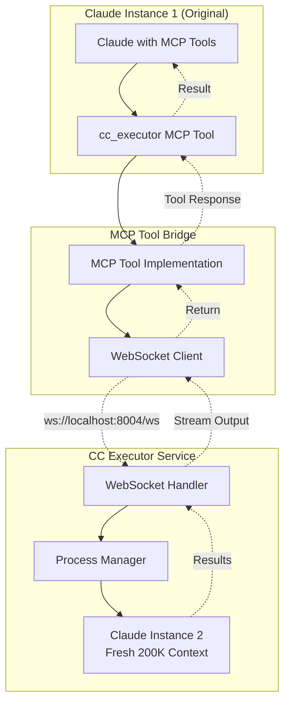

# MCP Tool to WebSocket Handler Bridge Architecture

## Overview

This document outlines the architecture for creating an MCP (Model Context Protocol) tool that bridges Claude's MCP tool invocation to the cc_executor WebSocket handler. This approach preserves the "fresh 200K context" benefit by spawning new Claude instances through the WebSocket handler infrastructure.

## Architecture Diagram



## Key Components

### 1. MCP Tool Definition

The MCP tool would be defined in the `.mcp.json` configuration:

```json
{
  "mcpServers": {
    "cc-executor": {
      "command": "python",
      "args": ["-m", "cc_executor.mcp_bridge"],
      "env": {
        "WEBSOCKET_URL": "ws://localhost:8004/ws",
        "EXECUTION_TIMEOUT": "600"
      }
    }
  }
}
```

### 2. MCP Tool Implementation

```python
# src/cc_executor/mcp_bridge.py
import asyncio
import json
import sys
import websockets
from typing import Dict, Any, Optional
from loguru import logger

class CCExecutorMCPTool:
    """MCP tool that bridges to the WebSocket handler for fresh Claude instances."""
    
    def __init__(self, websocket_url: str = "ws://localhost:8004/ws"):
        self.websocket_url = websocket_url
        self.name = "cc_executor"
        self.description = "Execute commands in a fresh context via cc_executor"
        
    async def execute_command(
        self,
        command: str,
        timeout: Optional[int] = None,
        stream_output: bool = True
    ) -> Dict[str, Any]:
        """
        Execute a command through the WebSocket handler.
        
        Args:
            command: The command to execute
            timeout: Optional timeout in seconds
            stream_output: Whether to stream output back to caller
            
        Returns:
            Dict containing execution results
        """
        output_lines = []
        exit_code = None
        error = None
        
        try:
            async with websockets.connect(self.websocket_url) as websocket:
                # Wait for connection confirmation
                connect_msg = await websocket.recv()
                connect_data = json.loads(connect_msg)
                session_id = connect_data['params']['session_id']
                logger.info(f"Connected to cc_executor: session {session_id}")
                
                # Send execute request
                request = {
                    "jsonrpc": "2.0",
                    "method": "execute",
                    "params": {
                        "command": command,
                        "timeout": timeout
                    },
                    "id": 1
                }
                await websocket.send(json.dumps(request))
                
                # Process responses
                while True:
                    msg = await websocket.recv()
                    data = json.loads(msg)
                    
                    if "result" in data:
                        # Initial response
                        if data["result"].get("status") == "started":
                            logger.info(f"Process started: PID {data['result']['pid']}")
                            
                    elif "method" in data:
                        # Handle notifications
                        if data["method"] == "process.output":
                            output = data["params"]["data"]
                            output_lines.append(output)
                            
                            # Stream to MCP if requested
                            if stream_output:
                                await self._stream_to_mcp(output)
                                
                        elif data["method"] == "process.completed":
                            exit_code = data["params"]["exit_code"]
                            break
                            
                        elif data["method"] == "process.error":
                            error = data["params"].get("error", "Unknown error")
                            break
                            
                    elif "error" in data:
                        error = data["error"]["message"]
                        break
                        
        except Exception as e:
            logger.error(f"WebSocket error: {e}")
            error = str(e)
            
        return {
            "success": error is None,
            "exit_code": exit_code or -1,
            "output": "".join(output_lines),
            "error": error,
            "session_id": session_id if 'session_id' in locals() else None
        }
        
    async def _stream_to_mcp(self, data: str):
        """Stream output back through MCP protocol."""
        # MCP streaming protocol
        message = {
            "jsonrpc": "2.0",
            "method": "stream",
            "params": {
                "type": "output",
                "data": data
            }
        }
        print(json.dumps(message), flush=True)
```

### 3. MCP Tool Interface

The tool would expose the following methods to Claude:

```python
async def handle_tool_request(request: Dict[str, Any]) -> Dict[str, Any]:
    """Handle incoming MCP tool requests from Claude."""
    
    method = request.get("method")
    params = request.get("params", {})
    
    if method == "execute":
        # Execute a command in fresh context
        command = params.get("command")
        timeout = params.get("timeout", 600)
        
        result = await tool.execute_command(
            command=command,
            timeout=timeout,
            stream_output=True
        )
        
        return {
            "jsonrpc": "2.0",
            "result": result,
            "id": request.get("id")
        }
        
    elif method == "execute_claude":
        # Special method for executing Claude commands with fresh context
        prompt = params.get("prompt")
        mcp_config = params.get("mcp_config", ".mcp.json")
        output_format = params.get("output_format", "stream-json")
        
        # Build Claude command
        command = f'claude -p --output-format {output_format} --verbose'
        if mcp_config:
            command += f' --mcp-config {mcp_config}'
        command += f' --dangerously-skip-permissions "{prompt}"'
        
        result = await tool.execute_command(
            command=command,
            timeout=params.get("timeout", 600),
            stream_output=True
        )
        
        # Parse Claude's stream-json output if needed
        if output_format == "stream-json" and result["success"]:
            result["parsed_events"] = parse_claude_stream_json(result["output"])
            
        return {
            "jsonrpc": "2.0",
            "result": result,
            "id": request.get("id")
        }
```

## Usage Examples

### Example 1: Simple Command Execution

From within Claude, the MCP tool could be invoked like:

```python
# Claude's perspective
result = await mcp__cc_executor__execute({
    "command": "python analyze_codebase.py",
    "timeout": 300
})
```

### Example 2: Fresh Claude Instance

```python
# Claude invoking another Claude instance with fresh context
result = await mcp__cc_executor__execute_claude({
    "prompt": "Analyze this 150K token codebase and provide insights",
    "timeout": 600,
    "output_format": "stream-json"
})

# Process the fresh Claude's response
for event in result["parsed_events"]:
    if event["type"] == "assistant":
        print(event["message"]["content"])
```

### Example 3: Complex Multi-Step Execution

```python
# Execute a complex task requiring fresh context
task_result = await mcp__cc_executor__execute({
    "command": """
    claude -p --mcp-config .mcp.json \\
      --allowedTools "mcp__github mcp__ripgrep" \\
      --dangerously-skip-permissions \\
      "Analyze all Python files in src/, identify code smells, 
       and create GitHub issues for each one found"
    """,
    "timeout": 1200  # 20 minutes for complex analysis
})
```

## Benefits of This Architecture

### 1. **Fresh 200K Context**
- Each invocation through the MCP tool spawns a new Claude instance
- No context pollution from the parent Claude instance
- Full 200K token window available for each task

### 2. **Process Isolation**
- Commands run in separate processes with proper cleanup
- Process group management ensures no orphaned processes
- Resource limits and timeouts prevent runaway executions

### 3. **Streaming Support**
- Real-time output streaming back to the original Claude
- Progress monitoring for long-running tasks
- Ability to cancel/control executions

### 4. **Error Handling**
- Graceful error propagation through the MCP protocol
- Timeout handling at multiple levels
- Detailed error messages for debugging

### 5. **Hook Integration**
- Pre-execution hooks for environment setup
- Post-execution hooks for metrics and validation
- Command complexity analysis for intelligent timeouts

## Implementation Considerations

### 1. **Authentication & Security**
- WebSocket connections should validate MCP tool identity
- Command whitelisting through ALLOWED_COMMANDS
- Rate limiting to prevent abuse

### 2. **Performance**
- Connection pooling for frequent invocations
- Caching of WebSocket connections
- Efficient streaming without buffering entire output

### 3. **Monitoring**
- Track MCP tool invocations through Redis metrics
- Log execution chains (Claude1 → MCP → Claude2)
- Performance metrics for nested executions

### 4. **Error Recovery**
- Retry logic for transient WebSocket failures
- Graceful degradation when WebSocket service unavailable
- Clear error messages propagated to parent Claude

## Configuration

### Environment Variables

```bash
# MCP Tool Configuration
CC_EXECUTOR_WEBSOCKET_URL=ws://localhost:8004/ws
CC_EXECUTOR_DEFAULT_TIMEOUT=600
CC_EXECUTOR_MAX_OUTPUT_SIZE=10485760  # 10MB
CC_EXECUTOR_STREAM_BUFFER_SIZE=65536   # 64KB chunks

# Security
CC_EXECUTOR_ALLOWED_COMMANDS=claude,python,node,bash
CC_EXECUTOR_REQUIRE_AUTH=true
CC_EXECUTOR_AUTH_TOKEN=<secure-token>
```

### MCP Tool Manifest

```json
{
  "name": "cc-executor",
  "version": "1.0.0",
  "description": "Execute commands with fresh context via cc_executor",
  "methods": {
    "execute": {
      "description": "Execute a command in fresh context",
      "parameters": {
        "command": {"type": "string", "required": true},
        "timeout": {"type": "integer", "default": 600},
        "stream_output": {"type": "boolean", "default": true}
      }
    },
    "execute_claude": {
      "description": "Execute Claude with fresh 200K context",
      "parameters": {
        "prompt": {"type": "string", "required": true},
        "timeout": {"type": "integer", "default": 600},
        "mcp_config": {"type": "string", "default": ".mcp.json"},
        "output_format": {"type": "string", "default": "stream-json"}
      }
    }
  }
}
```

## Testing Strategy

### 1. **Unit Tests**
- Test MCP protocol parsing and response generation
- Mock WebSocket connections for isolated testing
- Validate error handling paths

### 2. **Integration Tests**
- Test full flow: MCP → WebSocket → Process → Response
- Verify streaming functionality
- Test timeout and cancellation scenarios

### 3. **End-to-End Tests**
- Claude instance invoking MCP tool
- Complex multi-step executions
- Performance testing with large outputs

## Conclusion

The MCP Tool to WebSocket Handler bridge provides a robust solution for enabling fresh 200K context Claude invocations. By leveraging the existing WebSocket infrastructure, we maintain all the benefits of process isolation, streaming, and error handling while adding the ability for Claude to spawn fresh instances of itself or other commands through a simple MCP tool interface.

This architecture preserves the core value proposition of cc_executor - providing fresh context for complex tasks - while making it accessible through Claude's native MCP tool system.