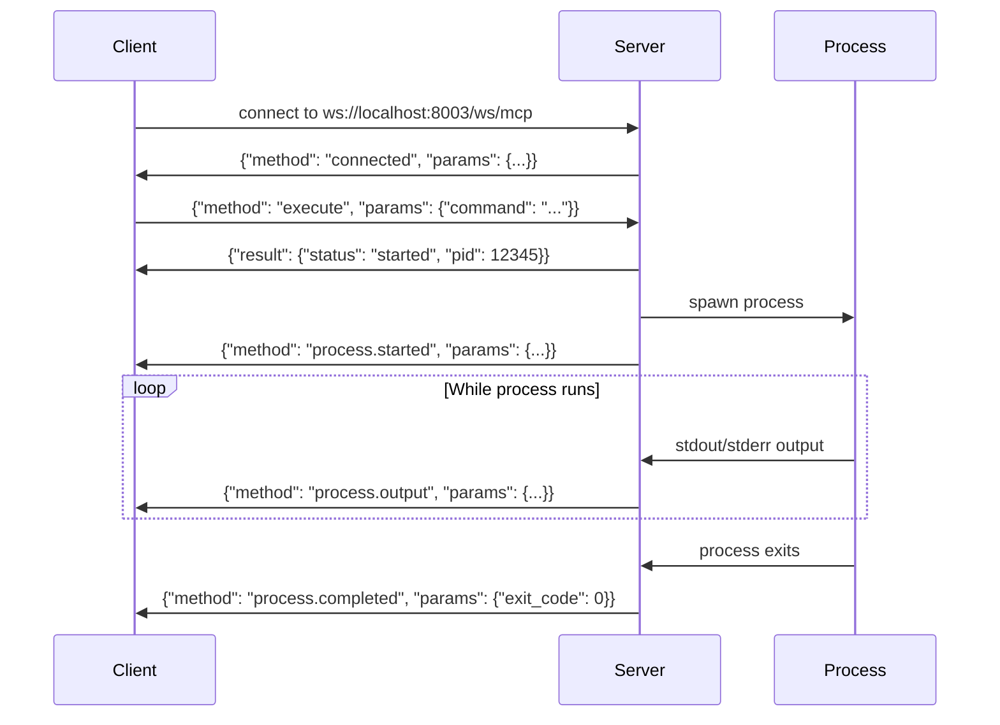
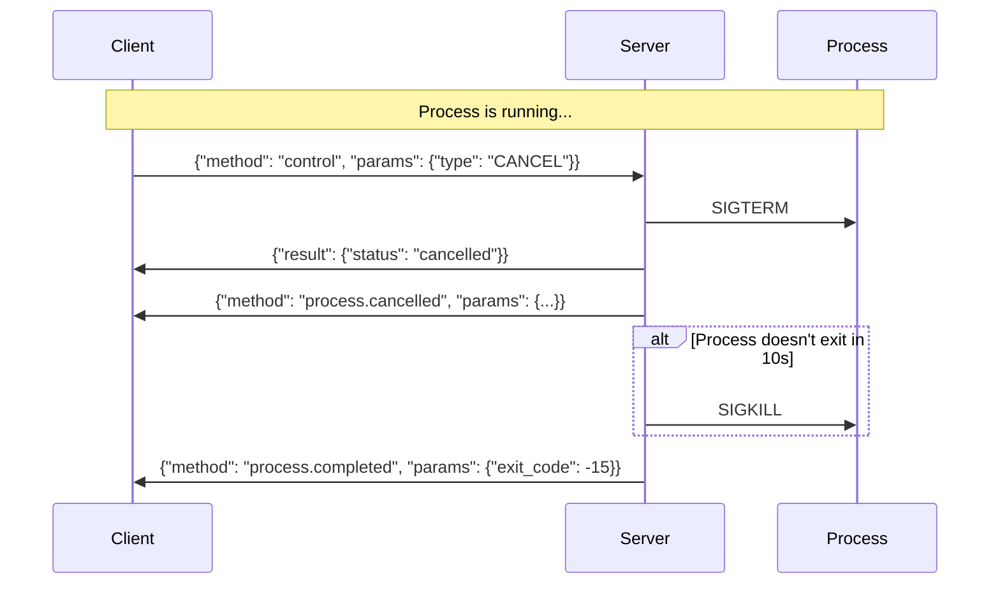

# WebSocket MCP Protocol Documentation

## Overview

CC-Executor implements a WebSocket-based Model Context Protocol (MCP) server that enables real-time, bidirectional communication for executing and controlling command-line processes. This document provides comprehensive documentation of the protocol, message formats, and usage patterns.

## Table of Contents

1. [Connection Establishment](#connection-establishment)
2. [Message Format](#message-format)
3. [Client-to-Server Commands](#client-to-server-commands)
4. [Server-to-Client Notifications](#server-to-client-notifications)
5. [Process Lifecycle](#process-lifecycle)
6. [Error Handling](#error-handling)
7. [Practical Examples](#practical-examples)
8. [Integration with Claude CLI](#integration-with-claude-cli)

## Connection Establishment

### WebSocket Endpoint
```
ws://localhost:8003/ws/mcp
```

### Initial Handshake
Upon connection, the server immediately sends a connection confirmation:

```json
{
  "method": "connected",
  "params": {
    "session_id": "550e8400-e29b-41d4-a716-446655440000",
    "version": "1.0.0",
    "capabilities": ["execute", "control", "stream"]
  }
}
```

The `session_id` uniquely identifies this WebSocket connection and is used for session management.

### Connection Features (v1.3.1+)
- **Connection Timeout**: 10-second timeout on WebSocket accept to prevent hanging
- **Heartbeat Mechanism**: 30-second heartbeat interval to detect dead connections
- **Message Queuing**: Automatic queuing of messages when client is temporarily disconnected
- **Reconnection Support**: Reconnection tokens allow resuming sessions with queued messages

## Message Format

All messages follow the JSON-RPC 2.0 specification:

### Request Format
```json
{
  "jsonrpc": "2.0",
  "id": 1,                    // Optional: for request/response correlation
  "method": "method_name",
  "params": {
    // Method-specific parameters
  }
}
```

### Response Format
```json
{
  "jsonrpc": "2.0",
  "id": 1,                    // Matches request ID
  "result": {
    // Method-specific result
  }
}
```

### Error Format
```json
{
  "jsonrpc": "2.0",
  "id": 1,
  "error": {
    "code": -32002,
    "message": "Command not allowed",
    "data": null              // Optional additional error data
  }
}
```

### Notification Format
Notifications are messages without an `id` field and don't expect a response:
```json
{
  "method": "notification_name",
  "params": {
    // Notification-specific data
  }
}
```

## Client-to-Server Commands

### 1. Execute Command

Starts a new process execution.

**Request:**
```json
{
  "jsonrpc": "2.0",
  "id": 1,
  "method": "execute",
  "params": {
    "command": "claude --print 'Write a haiku about Python'"
  }
}
```

**Response:**
```json
{
  "jsonrpc": "2.0",
  "id": 1,
  "result": {
    "status": "started",
    "pid": 12345,
    "pgid": 12345
  }
}
```

**Constraints:**
- Only one process can run per session at a time
- Commands must be in the allowed list (if configured)
- Command validation occurs before execution

### 2. Control Process

Controls a running process (pause, resume, or cancel).

**Request:**
```json
{
  "jsonrpc": "2.0",
  "id": 2,
  "method": "control",
  "params": {
    "type": "PAUSE" | "RESUME" | "CANCEL"
  }
}
```

**Control Types:**
- `PAUSE`: Sends SIGSTOP to the process group
- `RESUME`: Sends SIGCONT to the process group
- `CANCEL`: Sends SIGTERM, waits 10s, then SIGKILL if needed

**Response:**
```json
{
  "jsonrpc": "2.0",
  "id": 2,
  "result": {
    "status": "paused" | "resumed" | "cancelled"
  }
}
```

## Server-to-Client Notifications

### 1. Heartbeat Ping (v1.3.1+)

Sent every 30 seconds to detect dead connections.

```json
{
  "method": "ping",
  "params": {
    "timestamp": 1736874523.456
  }
}
```

**Expected Response:**
Clients should respond with a pong message:
```json
{
  "jsonrpc": "2.0",
  "method": "pong",
  "params": {}
}
```

If no pong is received within 60 seconds (2x heartbeat interval), the connection is closed.

### 2. Process Started

Sent immediately after a process begins execution.

```json
{
  "method": "process.started",
  "params": {
    "status": "started",
    "pid": 12345,
    "pgid": 12345,
    "exit_code": null,
    "error": null
  }
}
```

### 2. Process Output

Streams process output in real-time.

```json
{
  "method": "process.output",
  "params": {
    "type": "stdout" | "stderr",
    "data": "Hello, world!\n",
    "truncated": false
  }
}
```

**Notes:**
- Output is sent line-by-line as it becomes available
- Large lines (>8192 bytes) are truncated with `truncated: true`
- Preserves stdout/stderr separation

### 3. Process Completed

Sent when a process terminates.

```json
{
  "method": "process.completed",
  "params": {
    "status": "completed" | "failed",
    "pid": 12345,
    "pgid": 12345,
    "exit_code": 0,
    "error": null
  }
}
```

### 4. Process Control Notifications

Sent after successful control operations.

```json
{
  "method": "process.paused" | "process.resumed" | "process.cancelled",
  "params": {
    "status": "paused" | "resumed" | "cancelled",
    "pid": 12345,
    "pgid": 12345,
    "exit_code": null,
    "error": null
  }
}
```

### 5. Process Error

Sent when an error occurs during streaming or execution.

```json
{
  "method": "process.error",
  "params": {
    "error": "Stream timeout exceeded"
  }
}
```

## Process Lifecycle

### Normal Execution Flow



### Process Cancellation Flow



## Error Handling

### Error Codes

| Code   | Message                    | Description                              |
|--------|----------------------------|------------------------------------------|
| -32700 | Parse error               | Invalid JSON                             |
| -32600 | Invalid request           | Not a valid JSON-RPC request             |
| -32601 | Method not found          | Unknown method                           |
| -32602 | Invalid params            | Invalid method parameters                |
| -32603 | Internal error            | Internal server error                    |
| -32001 | Session limit exceeded    | Too many concurrent sessions             |
| -32002 | Command not allowed       | Command not in whitelist                 |
| -32003 | Process not found         | No process running for control operation |
| -32004 | Stream timeout            | Output stream timeout                    |

### Common Error Scenarios

**1. Command Not Allowed:**
```json
{
  "jsonrpc": "2.0",
  "id": 1,
  "error": {
    "code": -32002,
    "message": "Command 'rm' is not allowed"
  }
}
```

**2. Process Already Running:**
```json
{
  "jsonrpc": "2.0",
  "id": 2,
  "error": {
    "code": -32602,
    "message": "A process is already running"
  }
}
```

**3. No Process to Control:**
```json
{
  "jsonrpc": "2.0",
  "id": 3,
  "error": {
    "code": -32003,
    "message": "No process is running"
  }
}
```

## Practical Examples

### Example 1: Execute Claude and Handle Output

```python
import asyncio
import json
import websockets

async def execute_claude(prompt):
    uri = "ws://localhost:8003/ws/mcp"
    
    async with websockets.connect(uri) as websocket:
        # Wait for connection confirmation
        msg = await websocket.recv()
        connect_data = json.loads(msg)
        session_id = connect_data['params']['session_id']
        print(f"Connected with session: {session_id}")
        
        # Execute Claude command
        command = f'claude --print "{prompt}"'
        request = {
            "jsonrpc": "2.0",
            "id": 1,
            "method": "execute",
            "params": {"command": command}
        }
        await websocket.send(json.dumps(request))
        
        # Handle responses
        output_buffer = ""
        while True:
            msg = await websocket.recv()
            data = json.loads(msg)
            
            if 'result' in data:
                print(f"Process started: PID {data['result']['pid']}")
            
            elif data.get('method') == 'process.output':
                chunk = data['params']['data']
                output_buffer += chunk
                print(chunk, end='', flush=True)
            
            elif data.get('method') == 'process.completed':
                exit_code = data['params']['exit_code']
                print(f"\nProcess completed with exit code: {exit_code}")
                break
                
            elif 'error' in data:
                print(f"Error: {data['error']['message']}")
                break
        
        return output_buffer

# Usage
asyncio.run(execute_claude("Write a haiku about WebSockets"))
```

### Example 2: Execute with Timeout and Cancellation

```python
async def execute_with_timeout(command, timeout=30):
    uri = "ws://localhost:8003/ws/mcp"
    
    async with websockets.connect(uri) as websocket:
        # Skip connection message
        await websocket.recv()
        
        # Execute command
        await websocket.send(json.dumps({
            "jsonrpc": "2.0",
            "id": 1,
            "method": "execute",
            "params": {"command": command}
        }))
        
        # Wait for process to start
        start_msg = await websocket.recv()
        start_data = json.loads(start_msg)
        
        if 'error' in start_data:
            return {"error": start_data['error']['message']}
        
        # Monitor with timeout
        start_time = time.time()
        output = ""
        
        try:
            while time.time() - start_time < timeout:
                msg = await asyncio.wait_for(websocket.recv(), timeout=1.0)
                data = json.loads(msg)
                
                if data.get('method') == 'process.output':
                    output += data['params']['data']
                
                elif data.get('method') == 'process.completed':
                    return {
                        "output": output,
                        "exit_code": data['params']['exit_code']
                    }
        
        except asyncio.TimeoutError:
            # Cancel the process
            await websocket.send(json.dumps({
                "jsonrpc": "2.0",
                "id": 2,
                "method": "control",
                "params": {"type": "CANCEL"}
            }))
            
            # Wait for cancellation confirmation
            while True:
                msg = await websocket.recv()
                data = json.loads(msg)
                if data.get('method') == 'process.completed':
                    return {
                        "output": output,
                        "exit_code": data['params']['exit_code'],
                        "cancelled": True
                    }
```

### Example 3: Handling Stalled Output

```python
async def execute_with_stall_detection(command, stall_timeout=120):
    uri = "ws://localhost:8003/ws/mcp"
    
    async with websockets.connect(uri) as websocket:
        await websocket.recv()  # Skip connection
        
        # Execute
        await websocket.send(json.dumps({
            "jsonrpc": "2.0",
            "id": 1,
            "method": "execute",
            "params": {"command": command}
        }))
        
        last_output_time = time.time()
        output = ""
        
        while True:
            try:
                # Short timeout to check for stalls
                msg = await asyncio.wait_for(websocket.recv(), timeout=5.0)
                data = json.loads(msg)
                
                if data.get('method') == 'process.output':
                    last_output_time = time.time()
                    output += data['params']['data']
                
                elif data.get('method') == 'process.completed':
                    return {"output": output, "exit_code": data['params']['exit_code']}
                
            except asyncio.TimeoutError:
                # Check if output has stalled
                if time.time() - last_output_time > stall_timeout:
                    print(f"No output for {stall_timeout}s, cancelling...")
                    
                    await websocket.send(json.dumps({
                        "jsonrpc": "2.0",
                        "id": 2,
                        "method": "control",
                        "params": {"type": "CANCEL"}
                    }))
                    
                    # Wait for cancellation
                    while True:
                        msg = await websocket.recv()
                        data = json.loads(msg)
                        if data.get('method') == 'process.completed':
                            return {
                                "output": output,
                                "exit_code": data['params']['exit_code'],
                                "stalled": True
                            }
```

### Example 4: Handling Heartbeats (v1.3.1+)

```python
async def execute_with_heartbeat(command):
    uri = "ws://localhost:8003/ws/mcp"
    
    async with websockets.connect(uri) as websocket:
        # Wait for connection confirmation
        msg = await websocket.recv()
        connect_data = json.loads(msg)
        session_id = connect_data['params']['session_id']
        
        # Execute command
        await websocket.send(json.dumps({
            "jsonrpc": "2.0",
            "id": 1,
            "method": "execute",
            "params": {"command": command}
        }))
        
        output = ""
        while True:
            msg = await websocket.recv()
            data = json.loads(msg)
            
            # Handle heartbeat ping
            if data.get('method') == 'ping':
                # Respond with pong
                await websocket.send(json.dumps({
                    "jsonrpc": "2.0",
                    "method": "pong",
                    "params": {}
                }))
                print(f"Heartbeat ping received, pong sent")
                continue
            
            elif data.get('method') == 'process.output':
                output += data['params']['data']
                print(data['params']['data'], end='', flush=True)
            
            elif data.get('method') == 'process.completed':
                exit_code = data['params']['exit_code']
                print(f"\nProcess completed with exit code: {exit_code}")
                return {"output": output, "exit_code": exit_code}
            
            elif 'error' in data:
                print(f"Error: {data['error']['message']}")
                return {"error": data['error']['message']}
```

## Integration with Claude CLI

### Claude Output Formats

The WebSocket server correctly handles all Claude CLI output formats:

#### 1. Standard Text Output
```bash
claude --print "Write a haiku"
```
Output streams as regular text through `process.output` notifications.

#### 2. JSON Output
```bash
claude --print --output-format json "Write a haiku"
```
Single JSON object sent as one `process.output` notification.

#### 3. Stream-JSON Output
```bash
claude --print --output-format stream-json --verbose "Write a haiku"
```
Multiple JSON objects (JSONL format), each sent as separate `process.output` notifications.

### Parsing Stream-JSON Format

When using `--output-format stream-json`, each output line is a JSON object:

```python
async def parse_claude_stream_json(websocket):
    await websocket.recv()  # Skip connection
    
    # Execute Claude with stream-json
    command = 'claude -p --output-format stream-json --verbose "Write a haiku"'
    await websocket.send(json.dumps({
        "jsonrpc": "2.0",
        "id": 1,
        "method": "execute",
        "params": {"command": command}
    }))
    
    events = []
    while True:
        msg = await websocket.recv()
        data = json.loads(msg)
        
        if data.get('method') == 'process.output':
            # Each line is a JSON event from Claude
            line = data['params']['data'].strip()
            if line:
                try:
                    claude_event = json.loads(line)
                    events.append(claude_event)
                    
                    # Handle different Claude event types
                    if claude_event.get('type') == 'system':
                        print("Claude initialized")
                    elif claude_event.get('type') == 'assistant':
                        content = claude_event.get('message', {}).get('content', [])
                        for item in content:
                            if item.get('type') == 'text':
                                print(f"Claude: {item['text']}")
                    elif claude_event.get('type') == 'result':
                        print(f"Final result: {claude_event.get('result')}")
                        
                except json.JSONDecodeError:
                    # Not JSON, treat as regular output
                    print(line)
        
        elif data.get('method') == 'process.completed':
            break
    
    return events
```

## Best Practices

### 1. Connection Management
- Always handle the initial connection message
- Store the session_id for debugging
- Implement reconnection logic for network failures
- **Respond to heartbeat pings** to keep connection alive
- **Handle message queuing** for temporary disconnections

### 2. Error Handling
- Check for error responses after sending commands
- Handle both JSON-RPC errors and process errors
- Implement timeouts for long-running processes
- **Monitor for dead connections** using heartbeat responses

### 3. Output Processing
- Buffer output for complete lines when needed
- Handle both stdout and stderr streams
- Be prepared for truncated output on very long lines

### 4. Process Control
- Use CANCEL instead of killing the WebSocket connection
- Allow time for graceful shutdown with SIGTERM
- Monitor for stalled output and react appropriately

### 5. Security
- Validate commands before sending
- Use the ALLOWED_COMMANDS environment variable
- Never execute user input directly without validation

### 6. Connection Resilience (v1.3.1+)
- **Implement heartbeat handling** to maintain connection health
- **Support message queuing** for better reliability
- **Use reconnection tokens** when implementing reconnection logic
- **Set appropriate timeouts** for connection establishment (10s)

## Configuration

The WebSocket server can be configured via environment variables:

| Variable | Description | Default |
|----------|-------------|---------|
| `ALLOWED_COMMANDS` | Comma-separated list of allowed commands | None (all allowed) |
| `MAX_SESSIONS` | Maximum concurrent WebSocket sessions | 100 |
| `SESSION_TIMEOUT` | Session timeout in seconds | 3600 |
| `MAX_BUFFER_SIZE` | Maximum line size in bytes | 8192 |
| `STREAM_TIMEOUT` | Stream read timeout in seconds | 300 |
| `LOG_LEVEL` | Logging level | INFO |

Example Docker configuration:
```yaml
environment:
  - ALLOWED_COMMANDS=bash,claude,python,node,npm,git,ls,cat,echo,pwd
  - MAX_SESSIONS=50
  - LOG_LEVEL=DEBUG
```

## Conclusion

The CC-Executor WebSocket MCP protocol provides a robust, real-time interface for executing and controlling command-line processes. Its bidirectional nature enables sophisticated process management, making it ideal for orchestrating Claude Code executions and other long-running commands.

Key features:
- **Real-time streaming** of process output
- **Process control** (pause/resume/cancel)
- **Session isolation** for security
- **Comprehensive error handling**
- **JSON-RPC 2.0 compliance** for standardization
- **Connection resilience** with heartbeat and message queuing (v1.3.1+)
- **Automatic reconnection** support with queued message replay (v1.3.1+)

This protocol forms the foundation for building reliable command execution services that require real-time feedback and control capabilities, with enhanced resilience for production environments.