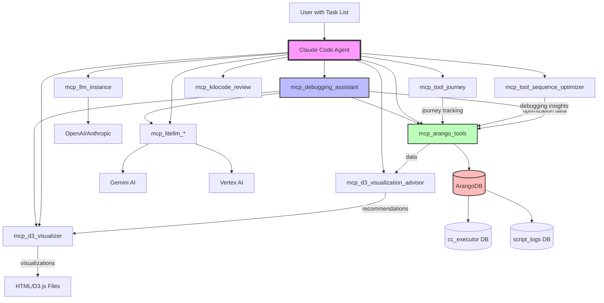
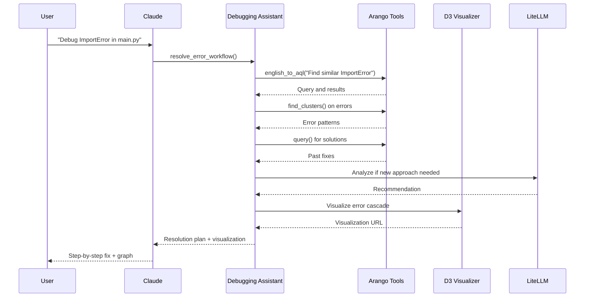

# MCP Server Architecture for Task-Based Agent Workflows

## Overview

This document explains how the MCP (Model Context Protocol) servers work together to enable Claude Code to perform complex tasks. The architecture is designed around **task lists** where each task can be decomposed into workflows that orchestrate multiple MCP servers.

## Architecture Diagram



## MCP Server Roles

### 1. **High-Level Orchestrators**

#### `mcp_debugging_assistant.py`
- **Role**: Orchestrates complex debugging workflows
- **Key Tools**:
  - `resolve_error_workflow()` - Complete error resolution process
  - `analyze_error_cascade()` - Understand error propagation
  - `learn_from_debugging_session()` - Extract and store lessons
  - `suggest_preventive_measures()` - Predict and prevent errors
  - `create_debugging_report()` - Generate comprehensive reports
- **Uses**: mcp_arango_tools, mcp_d3_visualizer, mcp_litellm_*

#### `mcp_tool_journey.py`
- **Role**: Tracks tool usage journeys for learning
- **Key Tools**:
  - `start_journey()` - Begin tracking a task
  - `add_step()` - Record each tool use
  - `complete_journey()` - Finalize and analyze
- **Purpose**: Learn optimal tool sequences

#### `mcp_tool_sequence_optimizer.py`
- **Role**: Optimizes tool usage patterns
- **Key Tools**:
  - `analyze_sequence()` - Evaluate tool chain efficiency
  - `suggest_optimizations()` - Recommend better sequences
- **Purpose**: Improve agent performance over time

### 2. **Core Data & Analytics**

#### `mcp_arango_tools.py`
- **Role**: Primary database interface
- **Key Tools**:
  - Basic: `query()`, `insert()`, `edge()`, `upsert()`
  - Analytics: `find_clusters()`, `detect_anomalies()`, `analyze_time_series()`
  - NLP: `english_to_aql()` - Natural language to queries
  - Visualization: `get_visualization_data()`, `prepare_graph_for_d3()`
- **Databases**: cc_executor (main), script_logs (debugging)

### 3. **Visualization Pipeline**

#### `mcp_d3_visualization_advisor.py`
- **Role**: Analyzes data and recommends visualizations
- **Key Tools**:
  - `analyze_data()` - Examine data characteristics
  - `recommend_visualization()` - Suggest best chart type
- **Output**: Layout recommendations for D3

#### `mcp_d3_visualizer.py`
- **Role**: Generates interactive visualizations
- **Key Tools**:
  - `generate_graph_visualization()` - Create D3.js graphs
  - `select_optimal_layout()` - Choose best layout
- **Layouts**: force, tree, radial, sankey, matrix, timeline

### 4. **AI & Analysis Services**

#### `mcp_litellm_request.py` / `mcp_litellm_batch.py`
- **Role**: Unified LLM interface
- **Purpose**: Abstract different LLM providers
- **Supports**: OpenAI, Anthropic, Vertex AI, Gemini

#### `mcp_llm_instance.py`
- **Role**: Direct LLM queries
- **Purpose**: Complex reasoning tasks

#### `mcp_kilocode_review.py`
- **Role**: Code review and analysis
- **Purpose**: Automated code quality checks

## Task Execution Flow

### Example: Debugging Error Task



## Task List Integration

The system is designed to handle task lists like those in `/usage_scenarios`:

### 1. **Simple Tasks**
- Direct MCP tool calls
- Example: "Insert error into database"
- Flow: Claude → mcp_arango_tools → ArangoDB

### 2. **Workflow Tasks**
- Multi-step processes
- Example: "Resolve error and learn from it"
- Flow: Claude → mcp_debugging_assistant → [multiple MCPs]

### 3. **Analysis Tasks**
- Data analysis with visualization
- Example: "Analyze error patterns over time"
- Flow: Claude → mcp_arango_tools → mcp_d3_visualization_advisor → mcp_d3_visualizer

### 4. **Learning Tasks**
- Extract insights for future use
- Example: "Learn from this debugging session"
- Flow: Claude → mcp_tool_journey → mcp_debugging_assistant → mcp_arango_tools

## Best Practices

### 1. **Task Decomposition**
```python
# Bad: Monolithic task
"Fix all errors in the project"

# Good: Decomposed tasks
[
    "1. Identify all current errors",
    "2. Cluster similar errors",
    "3. Resolve each cluster with appropriate strategy",
    "4. Create preventive measures",
    "5. Document lessons learned"
]
```

### 2. **Tool Selection**
- **For Debugging**: Start with mcp_debugging_assistant
- **For Data**: Use mcp_arango_tools
- **For Insights**: Combine analytics + visualization
- **For Learning**: Use journey tracking + assistant

### 3. **Workflow Patterns**

#### Pattern 1: Analyze → Act → Learn
```
1. mcp_arango_tools (analyze data)
2. mcp_debugging_assistant (take action)
3. mcp_tool_journey (track what worked)
```

#### Pattern 2: Visualize → Understand → Optimize
```
1. mcp_d3_visualization_advisor (recommend viz)
2. mcp_d3_visualizer (create viz)
3. mcp_tool_sequence_optimizer (improve process)
```

## Configuration

### Environment Variables
```bash
# Database
ARANGO_HOST=localhost
ARANGO_PORT=8529
ARANGO_DATABASE=cc_executor
ARANGO_USERNAME=root
ARANGO_PASSWORD=your_password

# AI Services
OPENAI_API_KEY=your_key
ANTHROPIC_API_KEY=your_key
GOOGLE_APPLICATION_CREDENTIALS=/path/to/credentials.json

# Paths
PYTHONPATH=/home/graham/workspace/experiments/cc_executor/src
```

### MCP Configuration (.mcp.json)
```json
{
  "servers": {
    "debugging-assistant": {
      "command": ["python", "mcp_debugging_assistant.py"],
      "cwd": "/path/to/servers"
    },
    "arango-tools": {
      "command": ["python", "mcp_arango_tools.py"],
      "cwd": "/path/to/servers"
    }
    // ... other servers
  }
}
```

## Testing with Usage Scenarios

The `/usage_scenarios` directory contains test cases:

1. **arango_tools_20_scenarios.md** - Core functionality tests
2. **arango_tools_integration_scenarios.md** - Multi-tool workflows
3. **arango_tools_edge_cases.md** - Error handling and limits

### Running a Scenario
```python
# Claude receives scenario
scenario = "Resolve ImportError and learn from it"

# Claude decomposes into steps
steps = [
    "1. Use debugging_assistant.resolve_error_workflow()",
    "2. Track with tool_journey",
    "3. Store insights with arango_tools",
    "4. Visualize pattern if useful"
]

# Execute each step
for step in steps:
    result = await execute_step(step)
    if result.needs_adaptation:
        adapt_strategy()
```

## Monitoring & Debugging

### 1. **Check MCP Logs**
```bash
~/.claude/mcp_logs/[server_name]_debug.log
```

### 2. **Query Execution History**
```python
# See what tools were used
await mcp__arango_tools__query(
    "FOR t IN tool_executions SORT t.timestamp DESC LIMIT 10 RETURN t"
)
```

### 3. **Visualize Tool Flow**
```python
# Create tool usage graph
await mcp__d3_visualizer__generate_graph_visualization(
    graph_data=await mcp__arango_tools__get_visualization_data(
        query_type="network",
        collection="tool_dependencies"
    )
)
```

## Common Task Patterns

### 1. **Error Resolution**
```
User Task: "Fix TypeError in data_processor.py"
↓
mcp_debugging_assistant.resolve_error_workflow()
├── mcp_arango_tools.english_to_aql() 
├── mcp_arango_tools.find_clusters()
├── mcp_litellm_request.complete()
└── mcp_d3_visualizer.generate_graph_visualization()
```

### 2. **Performance Analysis**
```
User Task: "Why is my code slow?"
↓
mcp_arango_tools.analyze_time_series()
├── mcp_d3_visualization_advisor.analyze_data()
├── mcp_d3_visualizer.generate_graph_visualization()
└── mcp_tool_sequence_optimizer.analyze_sequence()
```

### 3. **Learning Session**
```
User Task: "What did I learn today?"
↓
mcp_debugging_assistant.learn_from_debugging_session()
├── mcp_tool_journey.get_journey_summary()
├── mcp_arango_tools.upsert() [lessons]
└── mcp_arango_tools.edge() [relationships]
```

## Future Enhancements

1. **Real-time Collaboration** - Multiple agents sharing insights
2. **Predictive Debugging** - Anticipate errors before they occur
3. **Auto-optimization** - Self-improving tool sequences
4. **Cross-project Learning** - Share lessons between projects

## Summary

The MCP architecture enables Claude Code to:
- **Decompose** complex tasks into manageable workflows
- **Orchestrate** multiple specialized tools
- **Learn** from every interaction
- **Visualize** patterns and relationships
- **Optimize** performance over time

This task-based approach with specialized MCP servers provides a scalable, maintainable way to build intelligent agent workflows.