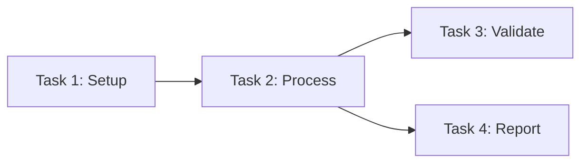

# [Task List Name] — Self-Improving Task List

<!--
IMPORTANT: This template is specifically for task lists, NOT for prompts.
Tasks are one-time executions that either succeed or fail.
We do NOT re-execute successful tasks to build a ratio.
-->

## 📊 TASK LIST METRICS & HISTORY
<!-- This section tracks overall task list performance -->
- **Total Tasks**: [X]
- **Completed Successfully**: [Y]
- **Failed & Improved**: [Z]
- **Current Success Rate**: [Y/(Y+Z)]%
- **Last Updated**: YYYY-MM-DD
- **Status**: [In Progress/Complete/Blocked]

## 🏛️ CORE PURPOSE (Immutable)
<!-- What this task list accomplishes - DO NOT CHANGE -->
[Clear description of the task list's goal]

## ⚠️ MANDATORY PRE-EXECUTION VALIDATION
<!-- Every task MUST be validated before execution -->
Before executing ANY task:
1. Read @docs/CLAUDE_CODE_PROMPT_RULES.md
2. Validate task against all rules
3. Auto-fix violations if possible
4. Document any manual fixes needed
5. NEVER execute a task that violates prompt rules

## 🤖 TASK DEFINITIONS (Self-Improving)
<!-- Each task evolves based on validation and execution results -->

### Task 1: [Task Name]
**Status**: [Not Started/In Progress/Complete/Failed]
**Current Definition**: "[Task in question format that passes validation]"
**Validation**: ✅ Compliant with CLAUDE_CODE_PROMPT_RULES.md

#### Evolution History:
| Version | Definition | Issue | Fix Applied |
|---------|------------|-------|-------------|
| v0 | "Create a config file" | NOT_QUESTION | Auto-converted to question |
| v1 | "What is a config file?" | Too vague, timeout | Added specific requirements |
| v2 | "What is a Python config.py with X, Y, Z?" | Success ✅ | N/A |

#### Execution Record:
- **Method Used**: [direct/cc_execute.md]
- **Duration**: [X seconds]
- **Result**: [Success/Failed - specific error]
- **Validation Passed**: [Yes/No - what failed]

### Task 2: [Task Name]
[Same structure as Task 1]

### Task 3: [Task Name]
[Same structure as Task 1]

## 📝 EXECUTION LOG
<!-- Document what actually happened during execution -->

### Execution Session: YYYY-MM-DD HH:MM
**System State**:
- Load Average: X.X
- Redis Available: Yes/No
- WebSocket Handler: Running/Not Running

**Pre-Execution Validation**:
- [ ] All tasks in question format
- [ ] No command verbs (Create, Write, Generate)
- [ ] Reasonable output length (<1000 words)
- [ ] Appropriate timeouts set
- [ ] No multi-step tasks

**Execution Results**:
| Task | Start Time | End Time | Result | Notes |
|------|------------|----------|--------|-------|
| 1 | HH:MM | HH:MM | ✅ Success | Direct execution |
| 2 | HH:MM | HH:MM | ❌ Timeout | Needs cc_execute.md |
| 3 | HH:MM | - | ⏸️ Blocked | Depends on Task 2 |

**Key Learnings**:
- Task 2 too complex for direct execution
- Need to add file size check before Task 3
- Question format critical for spawned instances

## 🔄 SELF-IMPROVEMENT PROTOCOL

### 1. Pre-Execution Validation & Auto-Fix
```python
def validate_and_fix_task(task_def):
    """Auto-fix common violations before execution"""
    fixes_applied = []
    
    # Fix: Not a question
    if not task_def.endswith("?"):
        if task_def.startswith(("Create", "Generate", "Build")):
            task_def = f"What is a {task_def[7:].lower()}?"
            fixes_applied.append("Converted command to question")
        else:
            task_def = f"What is {task_def}?"
            fixes_applied.append("Added question format")
    
    # Fix: Command verbs
    for cmd in ["Write", "Make", "Execute", "Run"]:
        if cmd in task_def:
            task_def = task_def.replace(cmd, "What happens when I")
            fixes_applied.append(f"Replaced '{cmd}' with question phrase")
    
    # Fix: Excessive length
    if "5000 word" in task_def:
        task_def = task_def.replace("5000 word", "500 word")
        fixes_applied.append("Reduced length to prevent overflow")
    
    return task_def, fixes_applied
```

### 2. Post-Execution Improvement
After EACH task execution:
1. If task succeeded → Document what worked, move to next task
2. If task failed → Apply improvement based on failure type:
   - **Timeout**: Make more explicit, consider cc_execute.md
   - **Token limit**: Break into smaller subtasks
   - **Ambiguity**: Add specific examples and constraints
   - **Validation failure**: Fix and re-validate before retry

### 3. Failure-Specific Improvements
| Failure Type | Improvement Strategy |
|--------------|---------------------|
| "Command format" | Convert to question with "What is...?" |
| "Timeout after X seconds" | Add explicit instructions, increase timeout |
| "Token limit exceeded" | Split task or use cc_execute.md |
| "Ambiguous prompt" | Add specific requirements and examples |
| "Rate limit" | Add delay, use cc_execute.md |
| "Output too large" | Add output constraints, use streaming |

### 4. Task Dependencies
<!-- Track which tasks depend on others -->


## 🎯 COMPLETION CRITERIA
<!-- When is this task list considered complete? -->

The task list is COMPLETE when:
- [ ] All tasks have executed successfully
- [ ] All validation criteria have been met
- [ ] No blocking errors remain
- [ ] Output artifacts have been verified

The task list is BLOCKED when:
- [ ] A task fails after 3 improvement attempts
- [ ] External dependency is unavailable
- [ ] Validation cannot be passed

## 🔍 DEBUGGING PATTERNS
<!-- Standard debugging approach for failed tasks -->

When a task fails:
1. Check execution log for specific error
2. Verify task passes CLAUDE_CODE_PROMPT_RULES.md
3. Check system load (if >14, wait or increase timeout)
4. For cc_execute.md tasks, verify WebSocket handler is running
5. Check Redis for similar task timeouts
6. Apply appropriate improvement from strategy table
7. Document the fix in Evolution History

## 📋 FINAL CHECKLIST
<!-- Before marking task list complete -->

- [ ] All tasks executed successfully
- [ ] No tasks required more than 3 improvement cycles
- [ ] All outputs validated against success criteria
- [ ] Execution log is complete and accurate
- [ ] Key learnings documented for future task lists
- [ ] Any new patterns added to improvement strategies

---

**Remember**: Each task executes ONCE. We improve failing tasks, but successful tasks are complete. The goal is 100% task completion, not repeated execution.