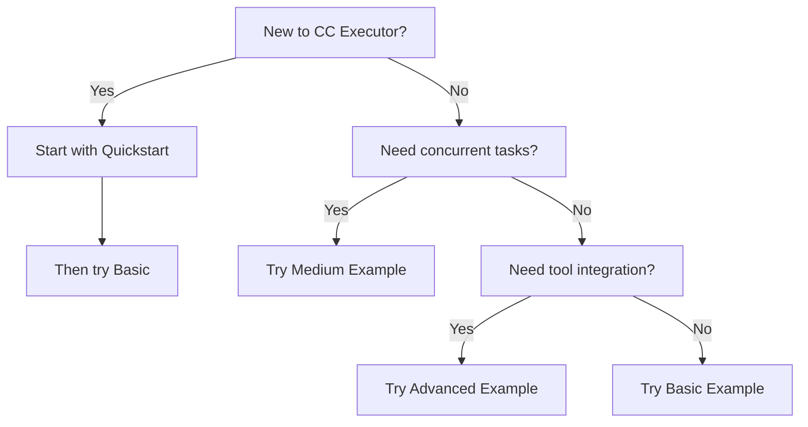

# CC Executor Examples

This directory contains examples demonstrating how to use CC Executor, organized by complexity level.

## 🚀 Example Structure

### 1. Quickstart (`quickstart/`)
**Time: 2 minutes** | **Difficulty: Beginner**

The simplest possible example - execute a single task with one function call.

```bash
cd quickstart
python quickstart.py
```

**You'll learn:**
- How to import and use `cc_execute`
- Basic task execution
- Understanding the output

### 2. Basic (`basic/`)
**Time: 5 minutes** | **Difficulty: Beginner**

Sequential task execution - building a TODO API step by step.

```bash
cd basic
python run_example.py
```

**You'll learn:**
- Sequential task lists
- Building on previous outputs
- Automatic UUID verification
- Response files and receipts

### 3. Medium (`medium/`)
**Time: 10 minutes** | **Difficulty: Intermediate**

Concurrent execution patterns for independent tasks.

```bash
cd medium
python concurrent_tasks.py
```

**You'll learn:**
- Concurrent execution with `asyncio`
- Semaphore rate limiting
- Progress tracking with `tqdm`
- Batch processing patterns
- ~2x speedup techniques

### 4. Advanced (`advanced/`)
**Time: 15 minutes** | **Difficulty: Advanced**

Production patterns with mixed execution modes and tool integration.

```bash
cd advanced
python run_example.py
```

**You'll learn:**
- When to use `cc_execute` vs direct execution
- MCP tool integration (perplexity-ask)
- External model verification
- Optimization strategies
- Complex workflows

## 📚 Additional Examples

### Utility Examples
- `cli_tool_limitations_workaround.py` - Understanding Claude CLI limitations
- `validation_pattern.py` - Using validation_prompt for quality control

## 🎯 Which Example Should I Start With?



## 🔑 Key Concepts Summary

### When to Use cc_execute
✅ **Use for:**
- Fresh 200K context needed
- Complex multi-step generation
- Long-running tasks (>1 minute)
- Anti-hallucination verification required
- Isolated execution needed

❌ **Don't use for:**
- Simple MCP tool calls
- Quick queries (<30 seconds)
- When context accumulation is desired

### Execution Patterns

#### Sequential (Basic)
```python
# Each task runs one after another
for task in tasks:
    result = await cc_execute(task)
```

#### Concurrent (Medium)
```python
# Multiple tasks run in parallel
async with Semaphore(3):  # Limit concurrency
    results = await gather(*[cc_execute(task) for task in tasks])
```

#### Mixed (Advanced)
```python
# Choose execution mode based on task
if task.needs_isolation:
    result = await cc_execute(task)
else:
    result = await mcp_tool.call(task)
```

## 📁 Directory Structure

```
examples/
├── README.md                    # This file
├── quickstart/                  # 2-minute intro
│   ├── README.md
│   └── quickstart.py
├── basic/                       # Sequential execution
│   ├── README.md
│   ├── task_list.md
│   └── run_example.py
├── medium/                      # Concurrent patterns
│   ├── README.md
│   └── concurrent_tasks.py
├── advanced/                    # Production patterns
│   ├── README.md
│   ├── task_list.md
│   └── run_example.py
├── cli_tool_limitations_workaround.py  # Utility example
├── validation_pattern.py               # Quality control
└── archive_*/                   # Old/deprecated examples
```

## 💡 Tips for Success

1. **Start Small**: Begin with quickstart, even if you're experienced
2. **Run Examples**: Don't just read - execute them to see the flow
3. **Check Outputs**: Look at `tmp/responses/` to understand verification
4. **Experiment**: Modify examples to match your use cases

## 🐛 Troubleshooting

### "Redis connection failed"
- Redis is optional - CC Executor will use simple timeouts
- To enable: `redis-server` or `docker run -d -p 6379:6379 redis`

### Task times out
- Default timeout is 300s (5 minutes)
- Increase with: `cc_execute(task, CCExecutorConfig(timeout=600))`

### Import errors
- Ensure CC Executor is installed: `pip install -e .`
- Check Python version: requires 3.10+

## 🚀 Next Steps

1. Complete all examples in order
2. Build your own task lists
3. Integrate into your projects
4. Share your patterns with the community!

---

**Questions?** Check the [main documentation](../README.md) or [open an issue](https://github.com/grahama1970/cc_executor/issues).