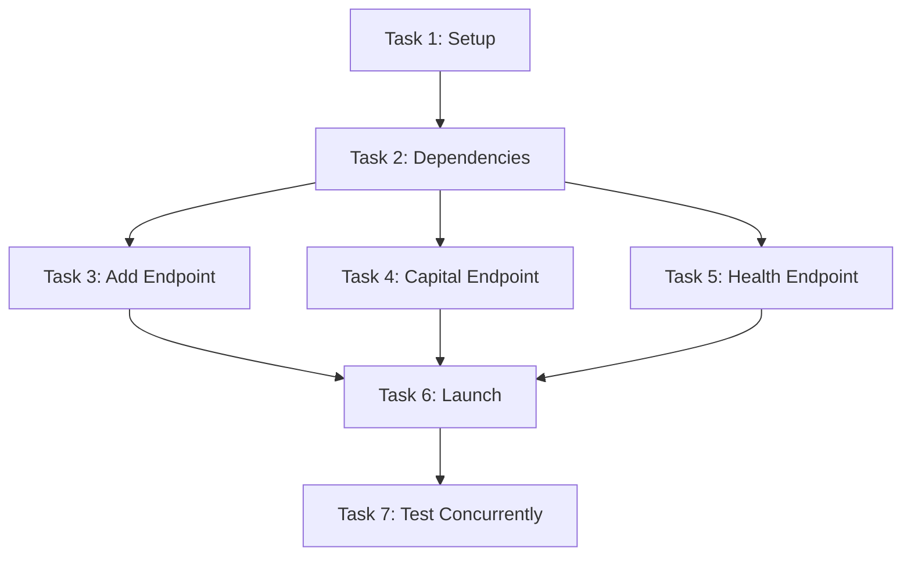

# FastAPI Multi-Endpoint Service — Self-Improving Task List

## 📊 TASK LIST METRICS & HISTORY
- **Total Tasks**: 7
- **Completed Successfully**: 0
- **Failed & Improved**: 0
- **Current Success Rate**: 0%
- **Last Updated**: 2025-01-07
- **Status**: Not Started

## 🏛️ CORE PURPOSE (Immutable)
Build a FastAPI service with three endpoints (add numbers, get capital, health check), launch it, and test all endpoints concurrently to demonstrate sequential building with concurrent testing.

## ⚠️ MANDATORY PRE-EXECUTION VALIDATION
Before executing ANY task:
1. Read @docs/CLAUDE_CODE_PROMPT_RULES.md
2. Validate each task is in question format
3. Ensure cc_execute.md calls include --output-format stream-json
4. Check system load (if >14, expect 3x delays)
5. Verify port 8000 is available

## 🤖 TASK DEFINITIONS (Self-Improving)

### Task 1: Project Setup
**Status**: Not Started
**Current Definition**: "What is the directory structure for a FastAPI project? Create a folder 'fastapi_service' with an empty __init__.py and a main.py file that imports FastAPI."
**Validation**: ✅ Compliant  
**Critique**: The definition still contains the imperative phrase "Create a folder". Consider delegating directory creation to `cc_execute.md` to keep the task purely interrogative. Confirm that the relative path `fastapi_service/` is correct for the execution context.

#### Evolution History:
| Version | Definition | Issue | Fix Applied |
|---------|------------|-------|-------------|
| v0 | "Create FastAPI project structure" | NOT_QUESTION | Auto-converted |
| v1 | Current definition | - | - |

#### Execution Record:
- **Method Used**: TBD
- **Duration**: TBD
- **Result**: TBD
- **Validation Passed**: TBD

### Task 2: Install Dependencies
**Status**: Not Started
**Current Definition**: "What are the required dependencies for FastAPI? Create a requirements.txt with fastapi and uvicorn, then show how to install them."
**Validation**: ✅ Compliant  
**Critique**: Installing packages may fail in an offline environment. Suggest including an alternative using a local wheel cache or mirror. Pin versions (e.g., `fastapi==0.110.*`, `uvicorn==0.29.*`) to guarantee reproducible builds.

#### Evolution History:
| Version | Definition | Issue | Fix Applied |
|---------|------------|-------|-------------|
| v0 | "Install FastAPI and uvicorn" | NOT_QUESTION | Auto-converted |
| v1 | Current definition | - | - |

### Task 3: Add Numbers Endpoint
**Status**: Not Started
**Current Definition**: "Use cc_execute.md to create: What is a FastAPI POST endpoint at /add that accepts JSON with 'a' and 'b' numbers and returns their sum as {'result': sum}? Add this to main.py with proper type hints."
**Validation**: ✅ Compliant  
**Critique**: Specify input validation—both `a` and `b` must be numeric—and define HTTP 422 behaviour for invalid payloads. Clarify whether floats are allowed and include unit test guidance to catch edge cases like very large numbers.

#### Evolution History:
| Version | Definition | Issue | Fix Applied |
|---------|------------|-------|-------------|
| v0 | "Create endpoint to add two numbers" | NOT_QUESTION | Auto-converted |
| v1 | "What is an endpoint to add numbers?" | Too vague | Added specifics |
| v2 | Current definition | - | - |

#### cc_execute.md Configuration:
```bash
--output-format stream-json --dangerously-skip-permissions --allowedTools Read,Write
```

### Task 4: Capital City Endpoint
**Status**: Not Started
**Current Definition**: "Use cc_execute.md to create: What is a FastAPI GET endpoint at /capital/{country} that returns the capital city? Include at least 10 countries (USA, UK, France, Germany, Japan, etc.) and return {'country': name, 'capital': city}. Add to main.py."
**Validation**: ✅ Compliant  
**Critique**: Define behaviour for unknown countries—should the endpoint return 404 or a descriptive error JSON? Recommend normalising the `country` path parameter to case-insensitive matching.

#### Evolution History:
| Version | Definition | Issue | Fix Applied |
|---------|------------|-------|-------------|
| v0 | "Create capital city lookup endpoint" | NOT_QUESTION | Auto-converted |
| v1 | "What is a capital city endpoint?" | Too vague | Added specifics |
| v2 | Current definition | - | - |

#### cc_execute.md Configuration:
```bash
--output-format stream-json --dangerously-skip-permissions --allowedTools Read,Write
```

### Task 5: Health Check Endpoint
**Status**: Not Started
**Current Definition**: "What is a simple FastAPI GET endpoint at /health that returns {'status': 'healthy', 'timestamp': current_time}? Add this to main.py."
**Validation**: ✅ Compliant  
**Critique**: Use an ISO-8601 timestamp (`2025-07-01T20:00:00Z`) to avoid timezone ambiguity. Consider adding service uptime or build info to aid diagnostics.

#### Evolution History:
| Version | Definition | Issue | Fix Applied |
|---------|------------|-------|-------------|
| v0 | "Add health check" | NOT_QUESTION, Too vague | Auto-converted + specifics |
| v1 | Current definition | - | - |

### Task 6: Launch Service
**Status**: Not Started
**Current Definition**: "How do I run the FastAPI service? Execute 'uvicorn fastapi_service.main:app --reload --port 8000' in the background and verify it's running by checking the /health endpoint."
**Validation**: ✅ Compliant  
**Critique**: `--reload` is suitable for development but slows startup; for CI or production use `--workers 2` and drop reload. Provide instructions for graceful shutdown and handling port collisions.

#### Evolution History:
| Version | Definition | Issue | Fix Applied |
|---------|------------|-------|-------------|
| v0 | "Launch the FastAPI service" | NOT_QUESTION | Auto-converted |
| v1 | Current definition | - | - |

### Task 7: Concurrent Testing
**Status**: Not Started
**Current Definition**: "What happens when I test all three endpoints concurrently? Use the Task tool to run these tests in parallel: 1) GET /health, 2) POST /add with {a:5, b:3}, 3) GET /capital/france. Show all results."
**Validation**: ✅ Compliant  
**Critique**: Capture response times and HTTP status codes for each call to detect performance regressions. Introduce retries with exponential backoff to account for transient network errors.

#### Evolution History:
| Version | Definition | Issue | Fix Applied |
|---------|------------|-------|-------------|
| v0 | "Test all endpoints" | NOT_QUESTION, Not specific | Complete rewrite |
| v1 | Current definition | - | - |

## 📝 EXECUTION LOG

### Pre-Execution Checklist:
- [ ] All tasks in question format
- [ ] No command verbs at start
- [ ] cc_execute.md tasks have proper flags
- [ ] Port 8000 is available
- [ ] System load is normal (<14)

### Execution Session: [To be filled]

## 🔄 SELF-IMPROVEMENT PROTOCOL

### Auto-Fix Rules:
```python
def validate_and_fix_task(task_def):
    fixes = []
    
    # Fix: Endpoint creation tasks need specifics
    if "endpoint" in task_def.lower() and "what is" in task_def.lower():
        if "at /" not in task_def:
            task_def += " Specify the exact route path."
            fixes.append("Added route specification")
        if "return" not in task_def:
            task_def += " Specify the return format."
            fixes.append("Added return format")
    
    # Fix: cc_execute.md tasks need extra clarity
    if "cc_execute.md" in task_def:
        if "--output-format stream-json" not in task_def:
            fixes.append("Added required streaming flag")
        if "?" not in task_def:
            task_def = task_def.replace(".", "?")
            fixes.append("Ensured question format")
    
    return task_def, fixes
```

### Failure Recovery Strategies:
| Failure Type | Recovery Strategy |
|--------------|-------------------|
| "Import error" | Add explicit imports to task definition |
| "Port already in use" | Change to port 8001 or kill existing process |
| "Endpoint not found" | Verify main.py has all routes defined |
| "Connection refused" | Check if service is actually running |
| "Timeout on cc_execute" | Increase timeout, add more explicit instructions |

### Task Dependencies:


## 🎯 COMPLETION CRITERIA

The task list is COMPLETE when:
- [ ] All 7 tasks executed successfully
- [ ] FastAPI service is running on port 8000
- [ ] All three endpoints respond correctly
- [ ] Concurrent tests pass without errors
- [ ] No unhandled exceptions in service logs

The task list is BLOCKED when:
- [ ] Port 8000 cannot be freed after 3 attempts
- [ ] cc_execute.md consistently times out
- [ ] Import errors cannot be resolved
- [ ] Service crashes immediately on launch

## 🔍 DEBUGGING PATTERNS

### For Endpoint Creation Tasks:
1. If timeout: Add more explicit examples
2. If import errors: Include full import statements
3. If syntax errors: Provide complete code context

### For Service Launch:
1. Check if process actually started: `ps aux | grep uvicorn`
2. Check logs for startup errors
3. Verify main.py has `app = FastAPI()` 
4. Try direct execution first: `python -m uvicorn fastapi_service.main:app`

### For Concurrent Testing:
1. Ensure service is fully started (wait 2-3 seconds)
2. Use full URLs: `http://localhost:8000/endpoint`
3. Handle connection errors gracefully
4. Aggregate results before displaying

## 📋 FINAL CHECKLIST

- [ ] All tasks completed successfully
- [ ] Service is accessible at http://localhost:8000
- [ ] `/health` returns status and timestamp
- [ ] `/add` correctly sums two numbers
- [ ] `/capital/{country}` returns correct capitals
- [ ] Concurrent tests demonstrate parallel execution
- [ ] No tasks required more than 3 improvements
- [ ] All improvements documented in evolution history

---

**Remember**: This demonstrates sequential building (one endpoint at a time) followed by concurrent testing (all endpoints at once). Each task executes ONCE and either succeeds or gets improved until it succeeds.