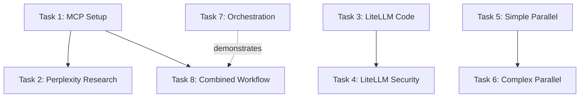

# Advanced Claude Workflows — Self-Improving Task List

> **KEY INSIGHT**: This task list demonstrates advanced workflows that BENEFIT from cc_execute.md's sequential orchestration. For single tasks, you'd use Claude directly. The value here is fresh 200K context per task in a multi-step workflow.

## 📊 TASK LIST METRICS & HISTORY
- **Total Tasks**: 8
- **Completed Successfully**: 0
- **Failed & Improved**: 0
- **Current Success Rate**: 0%
- **Last Updated**: 2025-01-04
- **Status**: Not Started

## 🏛️ CORE PURPOSE (Immutable)
Demonstrate advanced Claude workflows in a TASK LIST CONTEXT where cc_execute.md provides value through sequential orchestration. Shows how complex multi-step workflows benefit from fresh Claude instances per task, preventing context pollution and ensuring each task has full 200K tokens available.

## ⚠️ MANDATORY PRE-EXECUTION VALIDATION
Before executing ANY task:
1. Read @docs/CLAUDE_CODE_PROMPT_RULES.md
2. Validate each task is in question format
3. Ensure proper MCP configuration for perplexity-ask
4. Check that prompts/ask-litellm.md exists
5. Verify cc_execute.md WebSocket server is running

## 🤖 TASK DEFINITIONS (Self-Improving)

### Task 1: Setup and Verify MCP Configuration
**Status**: Not Started
**Current Definition**: "What MCP tools are available in the .mcp.json configuration? Verify that perplexity-ask is configured and test it with a simple query about quantum computing breakthroughs in 2024."
**Validation**: ✅ Compliant
**Critique**: Good starting task. Ensures MCP is working before complex workflows.

#### Evolution History:
| Version | Definition | Issue | Fix Applied |
|---------|------------|-------|-------------|
| v1 | Current definition | - | - |

#### Execution Record:
- **Method Used**: Direct execution with MCP tools
- **Duration**: TBD
- **Result**: TBD

### Task 2: Claude + Perplexity Research Workflow
**Status**: Not Started
**Current Definition**: "Use cc_execute.md to: How do I explain quantum entanglement in simple terms? After explaining, use the perplexity-ask MCP tool to research recent breakthroughs in quantum entanglement from 2024-2025 and update the explanation with the latest findings."
**Validation**: ✅ Compliant
**Critique**: Demonstrates MCP tool usage within cc_execute.md context.

#### Evolution History:
| Version | Definition | Issue | Fix Applied |
|---------|------------|-------|-------------|
| v1 | Current definition | - | - |

#### cc_execute.md Configuration:
```bash
--mcp-config .mcp.json --allowedTools "mcp__perplexity-ask__perplexity_ask" --output-format stream-json
```

### Task 3: LiteLLM Integration - Code Review
**Status**: Not Started  
**Current Definition**: "Use cc_execute.md to: What is a Python implementation of quicksort? Write the implementation, then follow the instructions in ./prompts/ask-litellm.md using the gemini-2.0-flash-exp model to critique the code for efficiency and suggest optimizations."
**Validation**: ✅ Compliant
**Critique**: Tests prompt file integration and external model usage.

#### Evolution History:
| Version | Definition | Issue | Fix Applied |
|---------|------------|-------|-------------|
| v1 | Current definition | - | - |

#### cc_execute.md Configuration:
```bash
--output-format stream-json --allowedTools "Read,Write,Bash"
```

### Task 4: LiteLLM Integration - Security Review
**Status**: Not Started
**Current Definition**: "Use cc_execute.md to: How do I create a FastAPI application with user authentication? After implementation, use ./prompts/ask-litellm.md with gemini-2.0-flash-exp to review for security vulnerabilities and best practices."
**Validation**: ✅ Compliant
**Critique**: More complex task combining code generation with security analysis.

#### Evolution History:
| Version | Definition | Issue | Fix Applied |
|---------|------------|-------|-------------|
| v1 | Current definition | - | - |

#### cc_execute.md Configuration:
```bash
--output-format stream-json --allowedTools "Read,Write,Edit,Bash" --timeout 300
```

### Task 5: Parallel Task Execution - Haiku Variations
**Status**: Not Started
**Current Definition**: "How can I use task spawning to create 5 different haiku variations about programming in parallel? Create all 5 variations concurrently, then compare them and select the most creative one. Show all 5 variations and explain the selection criteria."
**Validation**: ✅ Compliant
**Critique**: Simple parallel task demonstration without cc_execute.md (direct execution).

#### Evolution History:
| Version | Definition | Issue | Fix Applied |
|---------|------------|-------|-------------|
| v1 | Current definition | - | - |

#### Execution Method:
Direct execution using Claude's Task tool for parallel spawning

### Task 6: Parallel Implementation Comparison
**Status**: Not Started
**Current Definition**: "Use cc_execute.md to: What are three ways to implement binary search in Python? Spawn 3 parallel tasks: Task 1 writes an iterative implementation, Task 2 writes a recursive implementation, Task 3 writes a generic implementation that works with any comparable type. Then compare all three for readability, performance, and versatility."
**Validation**: ✅ Compliant
**Critique**: Complex parallel execution within cc_execute.md context.

#### Evolution History:
| Version | Definition | Issue | Fix Applied |
|---------|------------|-------|-------------|
| v1 | Current definition | - | - |

#### cc_execute.md Configuration:
```bash
--output-format stream-json --allowedTools "Write,Task" --timeout 180
```

### Task 7: Sequential Orchestration Pattern
**Status**: Not Started
**Current Definition**: "How do I demonstrate the orchestrator pattern using cc_execute.md? Create a sequence where: 1) First Claude instance creates a data model, 2) Second Claude instance uses that model to build an API, 3) Third Claude instance writes tests for the API. Each step should use cc_execute.md with fresh context."
**Validation**: ✅ Compliant
**Critique**: Core demonstration of cc_executor's main purpose.

#### Evolution History:
| Version | Definition | Issue | Fix Applied |
|---------|------------|-------|-------------|
| v1 | Current definition | - | - |

#### Orchestration Script:
```python
# Each subtask gets fresh 200K context
subtasks = [
    {"task": "Create a Pydantic data model for a blog post with title, content, author, and timestamps"},
    {"task": "Read the data model and create a FastAPI CRUD API for blog posts"},
    {"task": "Read the API implementation and write comprehensive pytest tests"}
]

for i, subtask in enumerate(subtasks):
    result = execute_task_via_websocket(
        task=subtask["task"],
        timeout=120,
        tools=["Read", "Write", "Edit"]
    )
    if not result["success"]:
        break
```

### Task 8: Combined Workflow - Research, Build, Review
**Status**: Not Started
**Current Definition**: "How do I build a Redis caching layer with best practices? Execute this workflow: 1) Use perplexity-ask to research Redis caching patterns in 2025, 2) Use cc_execute.md to implement a caching layer based on the research, 3) Use ask-litellm.md to review the implementation for performance and correctness."
**Validation**: ✅ Compliant
**Critique**: Combines all advanced features in one workflow.

#### Evolution History:
| Version | Definition | Issue | Fix Applied |
|---------|------------|-------|-------------|
| v1 | Current definition | - | - |

#### Multi-Step Execution:
1. Direct: perplexity-ask for research
2. cc_execute.md: Implementation with research context
3. cc_execute.md: LiteLLM review via prompt file

## 📝 EXECUTION LOG

### Pre-Execution Checklist:
- [ ] All tasks in question format
- [ ] MCP tools configured and accessible
- [ ] prompts/ask-litellm.md exists
- [ ] WebSocket server running
- [ ] cc_execute.md timeout appropriately

### Execution Session: [To be filled]

## 🔄 SELF-IMPROVEMENT PROTOCOL

### Auto-Fix Rules:
```python
def validate_and_fix_task(task_def):
    fixes = []
    
    # Fix: MCP tool tasks need proper config
    if "perplexity-ask" in task_def.lower():
        if "--mcp-config" not in task_def:
            fixes.append("Added MCP config flag")
    
    # Fix: Parallel tasks need Task tool
    if "parallel" in task_def.lower() or "spawn" in task_def.lower():
        if "--allowedTools" in task_def and "Task" not in task_def:
            fixes.append("Added Task tool for parallel execution")
    
    # Fix: LiteLLM tasks need prompt file check
    if "ask-litellm.md" in task_def:
        if "prompts/" not in task_def:
            task_def = task_def.replace("ask-litellm.md", "./prompts/ask-litellm.md")
            fixes.append("Fixed prompt file path")
    
    return task_def, fixes
```

### Failure Recovery Strategies:
| Failure Type | Recovery Strategy |
|--------------|-------------------|
| "MCP tool not found" | Check .mcp.json, restart with --mcp-config |
| "Prompt file not found" | Create minimal ask-litellm.md template |
| "Parallel task timeout" | Increase timeout, reduce parallel count |
| "WebSocket connection failed" | Start server with cc-executor server start |
| "Rate limit on external API" | Add retry logic with exponential backoff |

### Task Dependencies:


## 🎯 COMPLETION CRITERIA

The task list is COMPLETE when:
- [ ] All 8 tasks executed successfully
- [ ] MCP tools (perplexity-ask) used successfully
- [ ] LiteLLM integration demonstrated
- [ ] Parallel execution patterns shown
- [ ] Sequential orchestration verified
- [ ] Combined workflow completes all steps

The task list is BLOCKED when:
- [ ] MCP configuration cannot be loaded
- [ ] WebSocket server won't start
- [ ] External APIs (Perplexity/LiteLLM) are down
- [ ] Rate limits prevent completion

## 🔍 DEBUGGING PATTERNS

### For MCP Tool Issues:
1. Verify tool in .mcp.json: `cat .mcp.json | jq .mcpServers`
2. Test tool directly: `claude -p "test" --mcp-config .mcp.json`
3. Check API keys are valid
4. Use --verbose flag for debugging

### For cc_execute.md Issues:
1. Verify server: `cc-executor server status`
2. Check logs: `tail -f ~/.claude/projects/*/logs/*.log`
3. Test with simple task first
4. Increase timeout progressively

### For Parallel Execution:
1. Start with 2 parallel tasks before attempting 5
2. Use unique identifiers for each variation
3. Aggregate results before comparison
4. Handle partial failures gracefully

## 📋 FINAL CHECKLIST

- [ ] All advanced patterns demonstrated
- [ ] External tool integration verified
- [ ] Parallel and sequential patterns working
- [ ] Orchestrator pattern clearly shown
- [ ] Research → Build → Review workflow complete
- [ ] No tasks required more than 3 improvements
- [ ] Documentation updated with learnings

---

**Remember**: This task list demonstrates ALL advanced Claude workflows from the README, showing how cc_execute.md enables complex multi-tool, multi-model, and multi-instance patterns while maintaining clean separation of concerns.