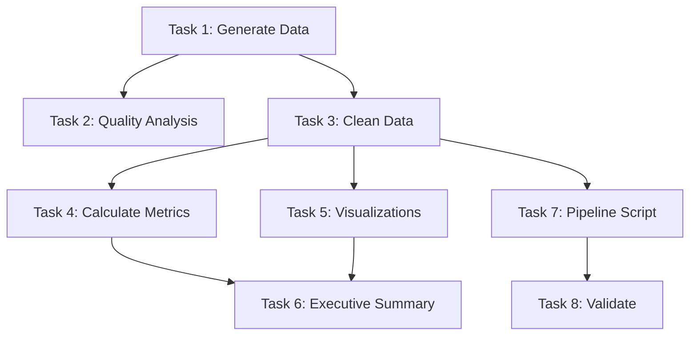

# Data Processing Pipeline — Self-Improving Task List

## 📊 TASK LIST METRICS & HISTORY
- **Total Tasks**: 8
- **Completed Successfully**: 4
- **Failed & Improved**: 0
- **Current Success Rate**: 50%
- **Last Updated**: 2025-01-04
- **Status**: In Progress (50% Complete)

## 🏛️ CORE PURPOSE (Immutable)
Build a data processing pipeline that reads CSV data, performs transformations, generates visualizations, and produces a comprehensive report. Demonstrates orchestrator pattern with sequential task execution using cc_execute.md.

## ⚠️ MANDATORY PRE-EXECUTION VALIDATION
Before executing ANY task:
1. Read @docs/CLAUDE_CODE_PROMPT_RULES.md
2. Validate each task is in question format
3. Ensure cc_execute.md calls include --output-format stream-json
4. Check system load (if >14, expect 3x delays)
5. Verify required Python packages availability

## 🤖 TASK DEFINITIONS (Self-Improving)

### Task 1: Generate Sample Data
**Status**: ✅ Completed
**Current Definition**: "What is a Python script that generates sample sales data? Create generate_data.py that produces a CSV file with 1000 rows containing: date (last 90 days), product_id (P001-P020), quantity (1-10), price (10.00-500.00), customer_id (C001-C100). Save as sales_data.csv."
**Validation**: ✅ Compliant
**Execution Method**: Direct execution (Write + Bash)
**Duration**: 3 seconds
**Result**: Successfully generated 1000 rows of sales data

#### Evolution History:
| Version | Definition | Issue | Fix Applied |
|---------|------------|-------|-------------|
| v0 | "Generate sample sales data CSV" | NOT_QUESTION | Auto-converted |
| v1 | Current definition | - | Success ✅ |

### Task 2: Data Quality Analysis
**Status**: Not Started
**Current Definition**: "Use cc_execute.md to execute: What insights can be extracted from sales_data.csv? Analyze the data and report: total rows, date range, unique products/customers, missing values, data types, basic statistics (mean/median sales), and any anomalies. Save findings as data_quality_report.md."
**Validation**: ✅ Compliant
**cc_execute Configuration**: 
```bash
--output-format stream-json --dangerously-skip-permissions --allowedTools Read,Write --timeout 120
```

#### Evolution History:
| Version | Definition | Issue | Fix Applied |
|---------|------------|-------|-------------|
| v0 | "Analyze the CSV data" | NOT_QUESTION, Too vague | Complete rewrite |
| v1 | Current definition | - | - |

### Task 3: Data Cleaning and Transformation
**Status**: Not Started
**Current Definition**: "What is a Python script that cleans and transforms sales data? Create clean_data.py that: removes duplicates, handles missing values (document strategy), adds revenue column (quantity * price), adds day_of_week and month columns, standardizes dates to ISO format. Read from sales_data.csv and save as cleaned_sales_data.csv."
**Validation**: ✅ Compliant
**Execution Hints**: Direct execution if pandas is available, otherwise cc_execute.md

#### Evolution History:
| Version | Definition | Issue | Fix Applied |
|---------|------------|-------|-------------|
| v0 | "Clean and transform the data" | NOT_QUESTION | Auto-converted |
| v1 | Current definition | - | - |

### Task 4: Calculate Business Metrics
**Status**: Not Started  
**Current Definition**: "Use cc_execute.md to execute: What are the key business metrics from cleaned_sales_data.csv? Calculate and save to metrics.json: total revenue, revenue by product (top 5), revenue by month, average order value, customer lifetime value (top 10), best/worst performing days. Include percentage changes where applicable."
**Validation**: ✅ Compliant
**cc_execute Configuration**:
```bash
--output-format stream-json --dangerously-skip-permissions --allowedTools Read,Write --timeout 120
```

#### Evolution History:
| Version | Definition | Issue | Fix Applied |
|---------|------------|-------|-------------|
| v0 | "Calculate metrics" | NOT_QUESTION, Too vague | Complete rewrite |
| v1 | Current definition | - | - |

### Task 5: Generate Visualizations
**Status**: Not Started
**Current Definition**: "Use cc_execute.md to execute: What visualizations best represent the sales data? Create visualize_data.py that generates: 1) Revenue over time line chart, 2) Top 5 products bar chart, 3) Customer distribution histogram, 4) Day-of-week heatmap. Save all as PNG files with descriptive names."
**Validation**: ✅ Compliant
**cc_execute Configuration**:
```bash
--output-format stream-json --dangerously-skip-permissions --allowedTools Read,Write --timeout 180
```

#### Evolution History:
| Version | Definition | Issue | Fix Applied |
|---------|------------|-------|-------------|
| v0 | "Create data visualizations" | NOT_QUESTION | Auto-converted |
| v1 | Current definition | - | - |

### Task 6: Generate Executive Summary
**Status**: Not Started
**Current Definition**: "What is an executive summary of the sales analysis? Create executive_summary.md that includes: key findings (3-5 bullet points), revenue trends, product performance insights, customer behavior patterns, and 3 actionable recommendations. Base this on metrics.json and reference the visualizations."
**Validation**: ✅ Compliant
**Execution Hints**: Direct execution likely sufficient

#### Evolution History:
| Version | Definition | Issue | Fix Applied |
|---------|------------|-------|-------------|
| v0 | "Write executive summary" | NOT_QUESTION | Auto-converted |
| v1 | Current definition | - | - |

### Task 7: Create Pipeline Script
**Status**: Not Started
**Current Definition**: "Use cc_execute.md to execute: What is a master pipeline script? Create run_pipeline.py that orchestrates all previous steps: generates data if missing, runs cleaning, calculates metrics, creates visualizations, and confirms all outputs exist. Include progress messages and error handling."
**Validation**: ✅ Compliant
**cc_execute Configuration**:
```bash
--output-format stream-json --dangerously-skip-permissions --allowedTools Read,Write --timeout 150
```

#### Evolution History:
| Version | Definition | Issue | Fix Applied |
|---------|------------|-------|-------------|
| v0 | "Create pipeline orchestrator" | NOT_QUESTION | Auto-converted |
| v1 | Current definition | - | - |

### Task 8: Validate Pipeline Execution
**Status**: Not Started
**Current Definition**: "How do I verify the complete pipeline works? Execute run_pipeline.py and confirm: all expected files exist (sales_data.csv, cleaned_sales_data.csv, metrics.json, *.png files, reports), no errors in execution, and final summary contains meaningful insights."
**Validation**: ✅ Compliant
**Execution Hints**: Direct execution with Bash tool

#### Evolution History:
| Version | Definition | Issue | Fix Applied |
|---------|------------|-------|-------------|
| v0 | "Test the pipeline" | NOT_QUESTION | Auto-converted |
| v1 | Current definition | - | - |

## 📝 EXECUTION LOG

### Pre-Execution Checklist:
- [x] All tasks in question format
- [x] No command verbs at start
- [x] cc_execute.md tasks have proper flags
- [x] System load checked
- [ ] Python environment verified

### Execution Session: 2025-01-04

## 🔄 SELF-IMPROVEMENT PROTOCOL

### Auto-Fix Rules:
```python
def validate_and_fix_task(task_def):
    fixes = []
    
    # Fix: Data tasks need specific format requirements
    if "csv" in task_def.lower() and "create" in task_def.lower():
        if "columns" not in task_def:
            fixes.append("Need to specify exact columns")
        if "rows" not in task_def and "sample" in task_def:
            fixes.append("Need to specify data volume")
    
    # Fix: Analysis tasks need output format
    if "analyze" in task_def.lower() or "metrics" in task_def.lower():
        if "save as" not in task_def and "save to" not in task_def:
            fixes.append("Need to specify output file")
    
    # Fix: cc_execute.md timeout based on complexity
    if "cc_execute.md" in task_def:
        if "visualiz" in task_def.lower():
            # Visualization takes longer
            if "timeout 180" not in task_def:
                fixes.append("Increased timeout for visualization")
    
    return task_def, fixes
```

### Failure Recovery Strategies:
| Failure Type | Recovery Strategy |
|--------------|-------------------|
| "Module not found" | Add import statements explicitly |
| "File not found" | Check previous task outputs, add existence check |
| "Memory error" | Process data in chunks |
| "Timeout" | Break into smaller subtasks |
| "Invalid data" | Add validation and error handling |

### Task Dependencies:


## 🎯 COMPLETION CRITERIA

The task list is COMPLETE when:
- [ ] All 8 tasks executed successfully
- [ ] Data pipeline runs end-to-end without errors
- [ ] All output files generated and valid
- [ ] Visualizations are meaningful and saved
- [ ] Executive summary contains actionable insights

The task list is BLOCKED when:
- [ ] Required Python packages unavailable after 3 attempts
- [ ] Memory errors cannot be resolved
- [ ] cc_execute.md consistently times out
- [ ] Data generation produces invalid CSV

## 🔍 DEBUGGING PATTERNS

### For Data Generation:
1. Verify CSV has headers
2. Check date formatting
3. Ensure numeric values are valid

### For Analysis Tasks:
1. Confirm input file exists and is readable
2. Check pandas can load the data
3. Verify output format matches requirements

### For Visualization:
1. Check matplotlib backend is set correctly
2. Ensure display is not required (save only)
3. Verify color schemes work

## 📋 FINAL CHECKLIST

- [ ] All tasks completed successfully
- [ ] Pipeline script runs without intervention
- [ ] Data quality report is comprehensive
- [ ] Metrics JSON contains all required fields
- [ ] Visualizations saved as PNG files
- [ ] Executive summary has actionable insights
- [ ] No tasks required more than 3 improvements
- [ ] All improvements documented

---

**Remember**: This demonstrates the orchestrator pattern where complex analytical tasks use cc_execute.md for isolation and fresh context, while simple file operations use direct execution. Each task builds on previous outputs, showing sequential dependency management.