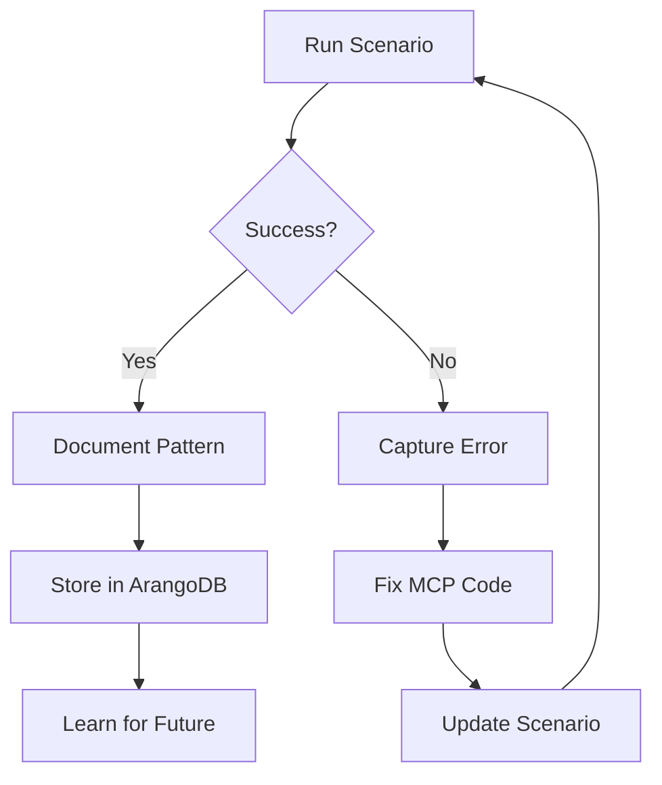

# MCP ArangoDB Tools Usage Scenarios

## Purpose & Philosophy

These usage scenarios serve as **living documentation** and **stress tests** for the `mcp_arango_tools` MCP server. They exist to:

1. **Stress Test the MCP**: Push the ArangoDB tools to their limits with real-world scenarios
2. **Drive Code Evolution**: When errors occur, they guide immediate fixes to the MCP code
3. **Learn from Failures**: Each error becomes a learning opportunity stored in the graph
4. **Document Patterns**: Successful patterns become reusable templates for agents

## How Agents Use These Scenarios

### 1. As Learning Material
Agents can study these scenarios to understand:
- Common ArangoDB query patterns
- Error handling strategies
- Performance optimization techniques
- Graph traversal best practices

### 2. As Test Suites
When modifying `mcp_arango_tools.py`, agents run these scenarios to:
- Verify existing functionality still works
- Test edge cases and error conditions
- Measure performance improvements
- Validate new features

### 3. As Error Catalysts
These scenarios intentionally push boundaries to:
- Trigger specific error conditions
- Test recovery mechanisms
- Validate error messages are helpful
- Ensure graceful degradation

## Scenario Files Overview

### 1. `arango_tools_20_scenarios.md`
**Core functionality testing across 20 real-world use cases**

- **Scenarios 1-5**: Basic CRUD operations and journey tracking
- **Scenarios 6-10**: Complex graph queries and pattern analysis
- **Scenarios 11-15**: Performance optimization and bulk operations
- **Scenarios 16-20**: Advanced analytics and ML integration

**Key Testing Areas:**
- Q-learning integration
- Thompson sampling parameters
- FAISS similarity search
- Community detection
- Anomaly detection
- Pattern evolution analysis

### 2. `arango_tools_edge_cases.md`
**Boundary conditions and error scenarios**

Tests include:
- Invalid collection names
- Malformed JSON parameters
- Missing required fields
- Circular graph references
- Memory-intensive operations
- Concurrent access patterns
- Network timeout scenarios
- Permission errors

**Purpose**: Ensures the MCP handles errors gracefully and provides actionable feedback.

### 3. `arango_tools_integration_scenarios.md`
**Cross-MCP integration testing**

Tests interactions between:
- `mcp_arango_tools` ↔ `mcp_tool_journey`
- `mcp_arango_tools` ↔ `mcp_outcome_adjudicator`
- `mcp_arango_tools` ↔ `mcp_debugging_assistant`
- Database state persistence across tool calls
- Transaction consistency
- Multi-tool workflows

## The Feedback Loop



## How to Use These Scenarios

### For Testing
```bash
# Run all scenarios
python test_arango_scenarios.py --all

# Run specific scenario
python test_arango_scenarios.py --scenario 15

# Run edge cases only
python test_arango_scenarios.py --edge-cases
```

### For Learning
```python
# Agent code to study patterns
result = await mcp__arango_tools__query(
    aql="FOR s IN scenario_results FILTER s.success == true RETURN s.pattern"
)
```

### For Debugging
When an MCP error occurs:
1. Find the matching scenario (or create one)
2. Reproduce the error consistently
3. Fix the MCP code
4. Verify the scenario now passes
5. Document the fix in the scenario

## Common Error Patterns & Fixes

### 1. JSON Parameter Parsing
**Error**: "Invalid JSON in bind_vars"
**Fix**: Added try/except with helpful error messages
**Scenario**: Edge case #3

### 2. Collection Validation
**Error**: "Collection not found"
**Fix**: Added `has_collection()` checks before operations
**Scenario**: Scenario #7

### 3. Memory Management
**Error**: "Out of memory during similarity search"
**Fix**: Implemented batch processing for large datasets
**Scenario**: Scenario #18

### 4. Concurrent Access
**Error**: "Write conflict"
**Fix**: Added retry logic with exponential backoff
**Scenario**: Integration scenario #5

## Adding New Scenarios

When you encounter a new error or use case:

1. **Document the Context**
   ```markdown
   ## Scenario X: [Descriptive Name]
   **Context**: What led to this scenario
   **Goal**: What we're trying to achieve
   **Error**: What went wrong (if applicable)
   ```

2. **Create Minimal Reproduction**
   ```python
   # Minimal code to reproduce the issue
   result = await mcp__arango_tools__[operation](...)
   ```

3. **Document the Fix**
   ```markdown
   **Fix Applied**: What changed in mcp_arango_tools.py
   **Verification**: How to confirm it's fixed
   ```

4. **Add to Appropriate File**
   - Core functionality → `arango_tools_20_scenarios.md`
   - Error conditions → `arango_tools_edge_cases.md`
   - Multi-tool workflows → `arango_tools_integration_scenarios.md`

## Success Metrics

These scenarios are successful when:
- ✅ All 20 core scenarios pass without errors
- ✅ Edge cases fail gracefully with helpful messages
- ✅ Integration scenarios maintain data consistency
- ✅ Performance benchmarks meet targets
- ✅ Error messages guide users to solutions

## Evolution Strategy

As the MCP evolves:
1. **Never delete scenarios** - Mark as deprecated if obsolete
2. **Version scenarios** - Track which MCP version they target
3. **Link to fixes** - Reference git commits that address issues
4. **Measure improvement** - Track error rates over time

## The Ultimate Goal

These scenarios transform the MCP from a static tool into a **learning system** that:
- Adapts to real-world usage patterns
- Improves through failure analysis
- Documents its own evolution
- Teaches future agents best practices

By treating errors as learning opportunities rather than failures, we create an antifragile system that gets stronger under stress.